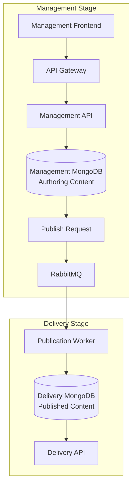

# ECMP Architecture

This document describes the planned architecture for the Enterprise Content Management Platform (ECMP).

The architecture is still evolving. Open decisions are documented explicitly so they can be resolved during the specification phase.

## System Context

ECMP is intended to be used by authenticated internal users through the Management Frontend. The platform does not currently expose a public consumer-facing experience or public external API.

Human users:

| Actor | Description |
| --- | --- |
| Creator | Content author responsible for creating and editing draft content. |
| Reviewer | Content author responsible for reviewing content before publication. |
| Publisher | Content author responsible for requesting publication and unpublication. |
| Admin | Administrative user responsible for managing users, roles, and platform access. |

Application clients:

| Client | Access |
| --- | --- |
| Management Frontend | Used by content authors and admins over HTTPS. |
| Internal Management API clients | Internal platform clients only. |
| Internal Delivery API clients | Internal platform clients only. |

External systems:

| System | Purpose |
| --- | --- |
| MongoDB | Stores structured content, content schemas, publication state, published content, and file metadata. |
| Redis | Stores sessions and cache data. |
| RabbitMQ | Transports asynchronous publication and unpublication events. |
| Filesystem-backed storage | Stores binary file content through a configured storage path or mounted volume. |

Out of scope for the current architecture:

* Public consumers.
* Public external clients using the Delivery API.
* Public external clients using the Management API.

## High-Level Architecture

ECMP separates content management from content delivery. Content authors and admins use a Management Frontend over HTTPS to create, edit, approve, publish, and unpublish content in the Management Stage. Internal clients read published content from the Delivery Stage through internal APIs. Publication between both stages is asynchronous and event-driven.



Management and Delivery storage are separated at database level. The Management Stage stores authoring content in a management database, while the Delivery Stage stores published content in a delivery database.

Both databases may run on the same MongoDB instance in local or simple environments. For stronger operational isolation, they may also run on separate MongoDB instances.

## Planned Monorepo Structure

The project will use a single repository with multiple independently deployable applications and services.

```text
ecmp-platform/
|-- apps/
|   `-- management-frontend/
|       `-- src/app/
|           |-- core/
|           |-- shared/
|           `-- features/
|               |-- content/
|               |-- content-types/
|               `-- publication/
|
|-- services/
|   |-- api-gateway/
|   |-- identity-service/
|   |-- content-service/
|   |-- content-type-service/
|   |-- publication-service/
|   |-- publication-worker/
|   `-- delivery-service/
|
|-- packages/
|   |-- shared-types/
|   |-- shared-events/
|   |-- shared-auth/
|   `-- shared-yaml/
|
|-- infrastructure/
|   |-- kubernetes/
|   |-- helm/
|   |-- docker/
|   `-- terraform/
|
|-- docs/
`-- .github/
```

Each application and service will be built and deployed independently while sharing common packages for types, events, authentication, and YAML handling.

## Management Frontend

The Management Frontend is the user interface for authenticated content authors and administrators.

Responsibilities:

* Authenticate users through the platform identity flow.
* Manage content types where permitted.
* Create, read, update, and delete content instances.
* Upload and manage file content metadata.
* Request content publication and unpublication.
* Display content lifecycle status.
* Surface validation errors from the backend APIs.

The frontend will communicate with backend services through the API Gateway. It will not access MongoDB, Redis, RabbitMQ, or filesystem storage directly.

Technology:

* Angular
* TypeScript
* Angular Router
* Angular Forms
* Angular HTTP Client

The Management Frontend will follow the same architectural principles as the backend. Feature areas should be organized around business capabilities, such as content, content types, and publication.

Planned feature structure:

```text
features/content/
|-- domain/
|-- application/
|-- infrastructure/
`-- presentation/
```

Layer responsibilities:

| Layer | Responsibility |
| --- | --- |
| Domain | Content entities, value objects, domain rules, and lifecycle constraints. |
| Application | Use cases such as creating content, updating content, publishing content, and unpublishing content. |
| Infrastructure | REST clients, DTO mapping, and API gateway communication. |
| Presentation | Angular components, pages, forms, view models, and UI state. |

## Planned Microservices

### Service Boundaries

Each service owns a specific part of the domain model and should expose that ownership through its API. Other services may read or request changes through published APIs or events, but they should not directly modify another service's owned data.

| Service | Owns |
| --- | --- |
| Identity Service | Authentication, authorization, sessions, users, and role assignments. |
| Content Type Service | Content type schemas and schema validation rules. |
| Content Service | Content drafts, master records, content lifecycle state, and file metadata. |
| Publication Service | Publication and unpublication requests, publication state, and publication events. |
| Publication Worker | Execution of publication and unpublication events between Management and Delivery stages. |
| Delivery Service | Published read model access and internal delivery queries. |
| API Gateway | Request routing, edge authentication integration, and cross-cutting API concerns. |

Ownership rules:

* The Content Service is the source of truth for draft and master content records.
* The Content Type Service is the source of truth for schemas.
* The Publication Service is the source of truth for publication requests.
* The Delivery Service exposes published read models but does not own authoring content.
* The Identity Service is the source of truth for authentication, authorization, sessions, users, and roles.
* The Publication Worker updates Delivery storage only as part of a publication or unpublication event.

### Initial REST API Contracts

The initial REST API is internal to the platform and primarily consumed by the Management Frontend and internal platform clients. Endpoint paths may be exposed through the API Gateway, while service implementations remain independently deployable.

All management endpoints require authentication. Authorization rules will be refined in the security model, but the initial role intent is:

| Role | Initial access |
| --- | --- |
| Creator | Create and update draft content. |
| Reviewer | Read and review content before publication. |
| Publisher | Request publication and unpublication. |
| Admin | Manage users, roles, content types, and platform access. |

#### Content CRUD

Owned by the Content Service.

| Method | Endpoint | Description |
| --- | --- | --- |
| `GET` | `/api/management/contents` | List content records from the Management database. |
| `GET` | `/api/management/contents/{contentId}` | Retrieve a content record by ID. |
| `POST` | `/api/management/contents` | Create a new draft content record. |
| `PUT` | `/api/management/contents/{contentId}` | Replace an existing content record. |
| `PATCH` | `/api/management/contents/{contentId}` | Partially update an existing content record. |
| `DELETE` | `/api/management/contents/{contentId}` | Delete or archive a content record, depending on lifecycle rules. |

Initial create/update payload shape:

```json
{
  "contentType": "generic",
  "data": {
    "title": "Welcome",
    "description": "First article",
    "publishDate": "2026-06-01"
  }
}
```

#### Content Type CRUD

Owned by the Content Type Service.

| Method | Endpoint | Description |
| --- | --- | --- |
| `GET` | `/api/management/content-types` | List content type schemas. |
| `GET` | `/api/management/content-types/{name}` | Retrieve the latest version of a content type schema. |
| `GET` | `/api/management/content-types/{name}/versions/{version}` | Retrieve a specific content type schema version. |
| `POST` | `/api/management/content-types` | Create a new content type schema. |
| `PUT` | `/api/management/content-types/{name}/versions/{version}` | Replace an existing content type schema version. |
| `DELETE` | `/api/management/content-types/{name}/versions/{version}` | Delete or deactivate a content type schema version, depending on lifecycle rules. |

Initial create/update payload shape:

```json
{
  "name": "generic",
  "version": "1.0",
  "schema": {
    "fields": {
      "title": {
        "type": "string",
        "required": true
      }
    }
  }
}
```

#### File Metadata Upload and Update

Owned by the Content Service.

The binary file is stored in filesystem-backed storage. MongoDB stores metadata and the storage path.

| Method | Endpoint | Description |
| --- | --- | --- |
| `POST` | `/api/management/files` | Upload a binary file and create file metadata. |
| `GET` | `/api/management/files/{fileId}` | Retrieve file metadata by ID. |
| `PATCH` | `/api/management/files/{fileId}` | Update file metadata. |
| `DELETE` | `/api/management/files/{fileId}` | Delete or archive file metadata and the associated binary file according to lifecycle rules. |

Initial metadata response shape:

```json
{
  "fileId": "file-001",
  "filename": "manual.pdf",
  "mimeType": "application/pdf",
  "size": 124500,
  "path": "/content/files/manual.pdf"
}
```

#### Publish Request

Owned by the Publication Service.

| Method | Endpoint | Description |
| --- | --- | --- |
| `POST` | `/api/management/contents/{contentId}/publication-requests` | Request publication for a content record. |
| `GET` | `/api/management/publication-requests/{requestId}` | Retrieve publication request status. |

Initial request payload shape:

```json
{
  "requestedBy": "user-001",
  "reason": "Ready for publication"
}
```

Initial response shape:

```json
{
  "requestId": "pub-001",
  "contentId": "article-001",
  "type": "publish",
  "status": "requested"
}
```

#### Unpublish Request

Owned by the Publication Service.

| Method | Endpoint | Description |
| --- | --- | --- |
| `POST` | `/api/management/contents/{contentId}/unpublication-requests` | Request unpublication for a content record. |
| `GET` | `/api/management/unpublication-requests/{requestId}` | Retrieve unpublication request status. |

Initial request payload shape:

```json
{
  "requestedBy": "user-001",
  "reason": "Content should no longer be available"
}
```

Initial response shape:

```json
{
  "requestId": "unpub-001",
  "contentId": "article-001",
  "type": "unpublish",
  "status": "requested"
}
```

#### Delivery Content Retrieval

Owned by the Delivery Service.

Delivery endpoints are internal read-only APIs backed by the Delivery MongoDB database.

| Method | Endpoint | Description |
| --- | --- | --- |
| `GET` | `/api/delivery/contents` | List published content records from the Delivery database. |
| `GET` | `/api/delivery/contents/{contentId}` | Retrieve a published content record by ID. |
| `GET` | `/api/delivery/contents?contentType={contentType}` | List published content records by content type. |

Initial response shape:

```json
{
  "contentId": "article-001",
  "contentType": "generic",
  "version": 1,
  "publishedAt": "2026-06-01T10:00:00.000Z",
  "data": {
    "title": "Welcome",
    "description": "First article",
    "publishDate": "2026-06-01"
  }
}
```

### API Gateway

Single entry point for the Management Frontend and internal platform API clients.

Responsibilities:

* Routing
* Authentication integration
* Rate limiting
* Request forwarding to internal services

### Identity Service

Handles authentication, authorization, and session management.

Ownership:

* Users
* Roles
* Authentication
* Authorization
* Sessions

Storage:

* Redis for session data

### Content Service

Manages content instances.

Ownership:

* Content drafts
* Master content records
* Content lifecycle state
* File metadata

Responsibilities:

* Content CRUD operations
* Content validation
* Content lifecycle management
* Versioning support in future phases

Storage:

* MongoDB for content metadata and structured content
* Filesystem-backed storage for binary files

### Content Type Service

Manages content schemas.

Ownership:

* Content type schemas
* Schema validation rules

Responsibilities:

* Content type definition
* Schema validation
* YAML schema parsing

Storage:

* MongoDB

### Publication Service

Coordinates publication and unpublication requests created from the Management Frontend.

Ownership:

* Publication requests
* Unpublication requests
* Publication state
* Publication events

Responsibilities:

* Publication request handling
* Unpublication request handling
* Event generation
* Publication state tracking

Dependencies:

* RabbitMQ
* MongoDB

### Publication Worker

Consumes publication events and synchronizes content between Management and Delivery stages.

Responsibilities:

* Event consumption
* Publish and unpublish execution
* Delivery stage synchronization

Dependencies:

* RabbitMQ
* MongoDB

### Delivery Service

Provides internal read-only content APIs.

Ownership:

* Published read model access
* Internal delivery queries

Responsibilities:

* Published content retrieval
* Internal REST endpoints
* High-performance read operations

Storage:

* Delivery MongoDB database

## Content Model

ECMP uses a schema-driven content architecture. Content types are defined as YAML schemas, and content instances are validated against those schemas before being stored.

Example content type definition:

```yaml
name: generic
version: 1.0

fields:
  title:
    type: string
    required: true

  description:
    type: string

  publishDate:
    type: date
```

Content type schemas define:

* Allowed fields
* Field data types
* Validation rules
* Required fields
* Extensibility rules

### Supported Field Types

The first implementation will support a small set of simple field types.

| Type | Description | Example |
| --- | --- | --- |
| `string` | Text value stored as a string. | `"Welcome"` |
| `integer` | Whole numeric value without decimal places. | `10` |
| `date` | Calendar date without time information, using ISO `YYYY-MM-DD` format. | `"2026-06-01"` |
| `time` | Time value without date information, using `HH:mm:ss` format. | `"14:30:00"` |

Additional field types may be added later when required by the platform.

### Validation Rules

Initial validation should remain simple and explicit.

Common validation rules:

| Rule | Description |
| --- | --- |
| `required` | Indicates whether the field must be present. |
| `type` | Indicates the expected field type. |

Type-specific validation:

| Type | Validation |
| --- | --- |
| `string` | Must be a string value. Empty strings are allowed unless the field is required and empty values are explicitly disallowed later. |
| `integer` | Must be a whole number. Decimal values are invalid. |
| `date` | Must be a valid ISO date using `YYYY-MM-DD` format. |
| `time` | Must be a valid time using `HH:mm:ss` format. |

Example validation error shape:

```json
{
  "field": "publishDate",
  "code": "INVALID_DATE",
  "message": "publishDate must be a valid date using YYYY-MM-DD format."
}
```

### Required and Optional Fields

Fields are optional by default.

If a field has `required: true`, content instances must provide a value for that field.

Example:

```yaml
fields:
  title:
    type: string
    required: true

  description:
    type: string
```

In this example, `title` is required and `description` is optional.

### Content ID Strategy

Content records will use globally unique identifiers.

Initial rules:

* The platform generates the `contentId`.
* `contentId` must be globally unique across content types.
* `contentId` remains stable for the lifetime of the content record.
* Content type names are not part of the uniqueness boundary.
* UUID v4 is the initial recommended format.

Example:

```text
contentId: 550e8400-e29b-41d4-a716-446655440000
```

Some examples in this document use readable placeholder identifiers such as `article-001` to keep the documentation easy to follow.

### Basic Versioning

The first implementation will use simple integer-based content versioning.

Initial rules:

* A new content record starts at version `1`.
* Each successful content update increments the version by `1`.
* `contentId` remains stable across all versions.
* Publication requests target a specific `contentId` and `contentVersion`.
* Delivery projections store the published `contentVersion`.
* Publishing the same `contentId` and `contentVersion` more than once must be idempotent.
* Advanced revision history can be added later as a future enhancement.

Example:

```json
{
  "contentId": "550e8400-e29b-41d4-a716-446655440000",
  "contentType": "generic",
  "version": 3,
  "status": "approved",
  "data": {}
}
```

### File Metadata Fields

The first implementation will store only minimal file metadata in MongoDB. Binary content is stored in filesystem-backed storage.

Initial file metadata fields:

| Field | Description |
| --- | --- |
| `fileId` | Globally unique file identifier generated by the platform. |
| `contentId` | Content record associated with the file. |
| `filename` | Original or normalized file name. |
| `mimeType` | MIME type detected or provided during upload. |
| `size` | File size in bytes. |
| `path` | Internal filesystem-backed storage path. |
| `createdAt` | UTC timestamp when the file metadata was created. |
| `updatedAt` | UTC timestamp when the file metadata was last updated. |

Example:

```json
{
  "fileId": "file-001",
  "contentId": "550e8400-e29b-41d4-a716-446655440000",
  "filename": "manual.pdf",
  "mimeType": "application/pdf",
  "size": 124500,
  "path": "/content/files/manual.pdf",
  "createdAt": "2026-06-01T10:00:00.000Z",
  "updatedAt": "2026-06-01T10:00:00.000Z"
}
```

## Initial Content Types

The first platform version will support two content types.

### Generic Content

Generic content represents structured editorial content.

Example use cases:

* Articles
* Landing pages
* Product descriptions
* Corporate information

Example:

```yaml
id: article-001
type: generic
title: Welcome
description: First article
publishDate: 2026-06-01
```

### File Content

File content represents binary assets. The binary file will be stored in a configured filesystem-backed storage location, while metadata will be stored in MongoDB.

Example use cases:

* PDFs
* Images
* Documents
* Videos

Example metadata:

```yaml
id: file-001
type: file
filename: manual.pdf
mimeType: application/pdf
size: 124500
path: /content/files/manual.pdf
```

## Content Lifecycle

Content will move through the following lifecycle states:

| State | Description |
| --- | --- |
| Draft | Content is being edited. |
| Approved | Content is ready for publication. |
| Publishing | A publication request is being processed. |
| Published | Content is available in the Delivery Stage. |
| Unpublished | Content has been removed from the Delivery Stage. |
| Archived | Content remains stored but is no longer active. |

## Publication Workflow

Publication must be asynchronous.

### Publication Strategy

ECMP will use projection-based publication.

In this strategy, the Publication Worker does not copy the Management content document directly into the Delivery database. Instead, it transforms the authoring content into a Delivery read model designed for internal read-only consumption.

The first implementation should keep the projection simple. The goal is to establish a clean separation between Management and Delivery without introducing a complex projection engine too early.

Initial delivery projection shape:

```json
{
  "contentId": "article-001",
  "contentType": "generic",
  "version": 1,
  "publishedAt": "2026-06-01T10:00:00.000Z",
  "data": {
    "title": "Welcome",
    "description": "First article",
    "publishDate": "2026-06-01"
  }
}
```

Projection rules:

* Only fields intended for delivery should be written into the Delivery database.
* Authoring-only metadata, workflow state, and management permissions must stay in the Management database.
* The Delivery model may evolve independently from the Management model.
* The first projection should preserve the validated content `data` structure unless a content type requires delivery-specific transformation.
* Projection logic should be covered by unit and integration tests.

### Retry Behavior

Publication and unpublication will not use automatic retries in the initial implementation.

If a publish or unpublish operation fails, the platform records the failure and notifies the user through the Management Frontend. A publisher can retry the operation manually after reviewing the error.

Initial retry rules:

* Failed publication requests remain visible in the Management Frontend.
* Failed unpublication requests remain visible in the Management Frontend.
* The Publication Worker does not automatically retry failed operations.
* Manual retry creates a new publication or unpublication attempt linked to the original request.
* Retry behavior may be expanded later if operational requirements justify automatic retries.

### Failure States

The initial workflow will start with simple failure states. More detailed states may be added later as the publication workflow becomes more sophisticated.

Initial publication request states:

| State | Description |
| --- | --- |
| `requested` | The publication or unpublication request has been created. |
| `processing` | The Publication Worker is processing the request. |
| `completed` | The request completed successfully. |
| `failed` | The request failed and requires manual review or retry. |

Content lifecycle states remain separate from request states. For example, a content item may remain `Approved` if publication fails before it reaches the Delivery Stage.

### Idempotency Rules

Publishing and unpublishing must be idempotent.

The Publication Worker should be able to safely receive the same event more than once without creating duplicate Delivery records, corrupting Delivery data, or incorrectly changing the final content state.

Initial idempotency rules:

* Publication events must include stable identifiers such as `eventId`, `publicationRequestId`, `contentId`, and `contentVersion`.
* Unpublication events must include stable identifiers such as `eventId`, `unpublicationRequestId`, `contentId`, and `contentVersion`.
* Publishing the same `contentId` and `contentVersion` more than once should result in the same Delivery projection.
* Unpublishing content that is already absent from Delivery should be treated as a successful no-op.
* The Delivery projection should be upserted by stable content identity, not blindly inserted.
* Processed event or request identifiers should be stored so duplicate events can be detected.

### Transactional Safety

Publishing and unpublishing should use transactional operations where possible to avoid incomplete changes when an error occurs halfway through the workflow.

Initial transactional rules:

* A publication operation must not leave a partially written Delivery projection.
* An unpublication operation must not leave a partially removed Delivery projection.
* Delivery database changes and publication request state changes should be committed atomically where the infrastructure supports it.
* If a transaction fails, the request should move to `failed` and the Management Frontend should show the error.
* Failure events should be emitted only after the failed state is recorded.

### Transaction and Event Publishing Model

ECMP will use a combination of database transactions and event publishing.

MongoDB transactions should protect state changes inside the platform databases. RabbitMQ events should be published after the related database transaction commits successfully. The system should not assume that MongoDB writes and RabbitMQ publishing are part of one distributed transaction.

Initial consistency rules:

* The Publication Service creates or updates a publication request inside a database transaction.
* After the transaction commits, the Publication Service publishes the corresponding `content.publish.requested` or `content.unpublish.requested` event.
* The Publication Worker applies Delivery database changes inside a database transaction.
* After the worker transaction commits, the Publication Worker publishes `content.published`, `content.unpublished`, `content.publish.failed`, or `content.unpublish.failed`.
* If the database transaction fails, no event should be published for that failed transaction.
* If event publishing fails after a successful transaction, the request should remain visible for manual review and retry.
* Event publishing failures should be logged with the `correlationId` and request identifier.
* A future implementation may introduce an outbox pattern if stronger delivery guarantees are required.

Publishing process:

1. An author requests publication.
2. The content status changes to `Publishing`.
3. A publication event is sent to RabbitMQ.
4. The Publication Worker consumes the event.
5. The content is projected into the Delivery Stage.
6. The content status changes to `Published`.

Unpublishing process:

1. An author requests unpublication.
2. An unpublication event is sent to RabbitMQ.
3. The Publication Worker consumes the event.
4. The content is removed from the Delivery Stage.
5. The content status changes to `Unpublished`.

Example events:

```text
content.publish.requested
content.published
content.publish.failed
content.unpublish.requested
content.unpublished
content.unpublish.failed
```

### Publication Event Payload Templates

Publication events should use a consistent envelope so producers and consumers can handle tracing, retries, idempotency, and future schema evolution in the same way.

Base event envelope:

```json
{
  "eventId": "evt-001",
  "eventType": "content.publish.requested",
  "eventVersion": "1.0",
  "occurredAt": "2026-06-01T10:00:00.000Z",
  "correlationId": "corr-001",
  "causationId": "request-001",
  "source": "publication-service",
  "data": {}
}
```

Common envelope fields:

| Field | Description |
| --- | --- |
| `eventId` | Unique event identifier. |
| `eventType` | Event name, such as `content.publish.requested`. |
| `eventVersion` | Payload schema version. |
| `occurredAt` | UTC timestamp when the event occurred. |
| `correlationId` | Identifier used to trace the full workflow. |
| `causationId` | Identifier of the request, command, or event that caused this event. |
| `source` | Service that emitted the event. |
| `data` | Event-specific payload. |

#### Publish Requested

Emitted by the Publication Service when a publisher requests content publication.

```json
{
  "eventId": "evt-publish-requested-001",
  "eventType": "content.publish.requested",
  "eventVersion": "1.0",
  "occurredAt": "2026-06-01T10:00:00.000Z",
  "correlationId": "corr-article-001-publication",
  "causationId": "pub-001",
  "source": "publication-service",
  "data": {
    "publicationRequestId": "pub-001",
    "contentId": "article-001",
    "contentType": "generic",
    "contentVersion": 1,
    "requestedBy": "user-001",
    "requestedByRole": "publisher",
    "reason": "Ready for publication",
    "managementDatabase": "ecmp_management",
    "deliveryDatabase": "ecmp_delivery"
  }
}
```

#### Published

Emitted after the Publication Worker successfully synchronizes content into the Delivery Stage.

```json
{
  "eventId": "evt-published-001",
  "eventType": "content.published",
  "eventVersion": "1.0",
  "occurredAt": "2026-06-01T10:00:05.000Z",
  "correlationId": "corr-article-001-publication",
  "causationId": "evt-publish-requested-001",
  "source": "publication-worker",
  "data": {
    "publicationRequestId": "pub-001",
    "contentId": "article-001",
    "contentType": "generic",
    "contentVersion": 1,
    "publishedAt": "2026-06-01T10:00:05.000Z",
    "deliveryRecordId": "article-001",
    "deliveryDatabase": "ecmp_delivery"
  }
}
```

#### Publish Failed

Emitted when the Publication Worker cannot complete publication.

```json
{
  "eventId": "evt-publish-failed-001",
  "eventType": "content.publish.failed",
  "eventVersion": "1.0",
  "occurredAt": "2026-06-01T10:00:05.000Z",
  "correlationId": "corr-article-001-publication",
  "causationId": "evt-publish-requested-001",
  "source": "publication-worker",
  "data": {
    "publicationRequestId": "pub-001",
    "contentId": "article-001",
    "contentType": "generic",
    "contentVersion": 1,
    "failureCode": "DELIVERY_SYNC_FAILED",
    "failureMessage": "Unable to synchronize content into the Delivery database.",
    "automaticRetry": false,
    "manualRetryAllowed": true,
    "attempt": 1
  }
}
```

#### Unpublish Requested

Emitted by the Publication Service when a publisher requests content removal from the Delivery Stage.

```json
{
  "eventId": "evt-unpublish-requested-001",
  "eventType": "content.unpublish.requested",
  "eventVersion": "1.0",
  "occurredAt": "2026-06-01T11:00:00.000Z",
  "correlationId": "corr-article-001-unpublication",
  "causationId": "unpub-001",
  "source": "publication-service",
  "data": {
    "unpublicationRequestId": "unpub-001",
    "contentId": "article-001",
    "contentType": "generic",
    "contentVersion": 1,
    "requestedBy": "user-001",
    "requestedByRole": "publisher",
    "reason": "Content should no longer be available",
    "deliveryDatabase": "ecmp_delivery"
  }
}
```

#### Unpublished

Emitted after the Publication Worker successfully removes content from the Delivery Stage.

```json
{
  "eventId": "evt-unpublished-001",
  "eventType": "content.unpublished",
  "eventVersion": "1.0",
  "occurredAt": "2026-06-01T11:00:05.000Z",
  "correlationId": "corr-article-001-unpublication",
  "causationId": "evt-unpublish-requested-001",
  "source": "publication-worker",
  "data": {
    "unpublicationRequestId": "unpub-001",
    "contentId": "article-001",
    "contentType": "generic",
    "contentVersion": 1,
    "unpublishedAt": "2026-06-01T11:00:05.000Z",
    "deliveryRecordId": "article-001",
    "deliveryDatabase": "ecmp_delivery"
  }
}
```

#### Unpublish Failed

Emitted when the Publication Worker cannot complete unpublication.

```json
{
  "eventId": "evt-unpublish-failed-001",
  "eventType": "content.unpublish.failed",
  "eventVersion": "1.0",
  "occurredAt": "2026-06-01T11:00:05.000Z",
  "correlationId": "corr-article-001-unpublication",
  "causationId": "evt-unpublish-requested-001",
  "source": "publication-worker",
  "data": {
    "unpublicationRequestId": "unpub-001",
    "contentId": "article-001",
    "contentType": "generic",
    "contentVersion": 1,
    "failureCode": "DELIVERY_REMOVAL_FAILED",
    "failureMessage": "Unable to remove content from the Delivery database.",
    "automaticRetry": false,
    "manualRetryAllowed": true,
    "attempt": 1
  }
}
```

Payload fields may be refined when the publication retry strategy, failure handling, and idempotency rules are finalized.

## Data Storage

| Component | Storage |
| --- | --- |
| Authoring structured content | Management MongoDB database |
| Published structured content | Delivery MongoDB database |
| Content type schemas | Management MongoDB database |
| File metadata | Management MongoDB database |
| File metadata | Delivery MongoDB database |
| Binary files | Management Filesystem-backed storage path or mounted volume |
| Binary files | Delivery Filesystem-backed storage path or mounted volume |
| Sessions | Redis |
| Cache | Redis |
| Publication events | RabbitMQ |

Management and Delivery data must not share the same MongoDB collections. The minimum separation is two databases in one MongoDB instance. A stronger deployment may use one MongoDB instance for Management and another MongoDB instance for Delivery.

### Content Collection

```json
{
  "_id": "...",
  "contentId": "...",
  "contentType": "generic",
  "status": "published",
  "version": 1,
  "data": {}
}
```

### Content Type Collection

```json
{
  "_id": "...",
  "name": "generic",
  "version": "1.0",
  "schema": {}
}
```

### File Metadata

```json
{
  "fileId": "file-001",
  "contentId": "550e8400-e29b-41d4-a716-446655440000",
  "filename": "manual.pdf",
  "mimeType": "application/pdf",
  "size": 124500,
  "path": "/content/files/manual.pdf",
  "createdAt": "2026-06-01T10:00:00.000Z",
  "updatedAt": "2026-06-01T10:00:00.000Z"
}
```

## Technology Stack

| Layer | Technology |
| --- | --- |
| Frontend | Angular |
| Language | TypeScript |
| Runtime | Node.js |
| Backend framework | NestJS |
| Frontend framework | Angular |
| Database | MongoDB |
| Cache | Redis |
| Messaging | RabbitMQ |
| File storage | Filesystem-backed storage |
| Containerization | Docker |
| Orchestration | Kubernetes |
| API | REST |
| Schema definition | YAML |
| Content definition | YAML |

REST will be the initial and primary API style. GraphQL may be considered later as a future enhancement.

## Testing Strategy

The project will follow a test-driven development approach where practical, especially for domain rules, application use cases, validation logic, and publication workflows.

Planned testing tools:

| Test type | Tooling |
| --- | --- |
| Frontend unit tests | Vitest and Angular testing utilities |
| Frontend integration tests | Vitest, Angular testing utilities, and mocked HTTP clients |
| Frontend end-to-end tests | Playwright |
| Backend unit tests | Vitest or Jest, pending backend scaffold decision |
| Backend integration tests | Test containers or local infrastructure dependencies, pending implementation |
| API end-to-end tests | Playwright or dedicated HTTP-based test suites |

Frontend test coverage should include:

* Domain rules and value objects.
* Application use cases.
* DTO and API response mapping.
* Angular components and forms.
* Validation error handling.
* Content CRUD flows.
* Publish and unpublish flows.

## Cloud-Native Principles

ECMP is designed around cloud-native application principles:

* Services are stateless.
* Runtime state is externalized.
* Services are packaged as Linux containers.
* Configuration is provided through environment variables.
* Logs are written to stdout and stderr.
* Services are independently deployable.
* Scaling is performed by increasing service replicas.
* Kubernetes is the target deployment platform.

## Twelve-Factor Alignment

The platform will follow the Twelve-Factor App methodology where applicable:

| Factor | ECMP Approach |
| --- | --- |
| Codebase | One Git repository for all services and shared packages. |
| Dependencies | Explicit dependencies per service or package. |
| Configuration | Environment variables for runtime configuration. |
| Backing services | MongoDB, Redis, RabbitMQ, and filesystem-backed storage treated as attached resources. |
| Build, release, run | CI/CD will separate build, release, and runtime concerns. |
| Processes | Services run as stateless processes. |
| Port binding | Services expose HTTP APIs through network ports. |
| Concurrency | Scaling is achieved through replicas. |
| Disposability | Services support fast startup and graceful shutdown. |
| Dev/prod parity | Development and production should remain as similar as possible. |
| Logs | Logs are emitted to stdout and stderr. |
| Admin processes | Administrative tasks run as one-off processes. |

## Kubernetes Deployment Model

The reference deployment platform is Kubernetes.

Planned workloads:

```text
management-frontend
api-gateway
identity-service
content-service
content-type-service
publication-service
publication-worker
delivery-service
```

Deployment goals:

* Multiple replicas for stateless services.
* Horizontal Pod Autoscaling where useful.
* Graceful shutdown for services and workers.
* Queue-aware scaling for publication workers.
* Health checks and readiness probes.
* Externalized configuration through Kubernetes resources.

## Observability

Observability is a core requirement.

Planned capabilities:

* Structured JSON logs
* Correlation IDs
* Trace IDs
* Metrics collection
* Request latency tracking
* Publication latency tracking
* RabbitMQ queue depth monitoring

OpenTelemetry is planned for metrics and distributed tracing.

## Non-Functional Requirements

| Requirement | Description |
| --- | --- |
| Scalability | Services must support horizontal scaling. |
| Availability | No critical service should depend on a single running instance. |
| Performance | Delivery APIs should provide low-latency read access. |
| Security | Role-based access control will protect management operations and frontend access. |
| Usability | Content authors should be able to perform CRUD and publish or unpublish operations through the frontend. |
| Observability | Logs, metrics, and traces must support troubleshooting. |
| Extensibility | New content types should be introduced without application code changes. |
| Portability | The platform should run in local containers and Kubernetes environments. |
