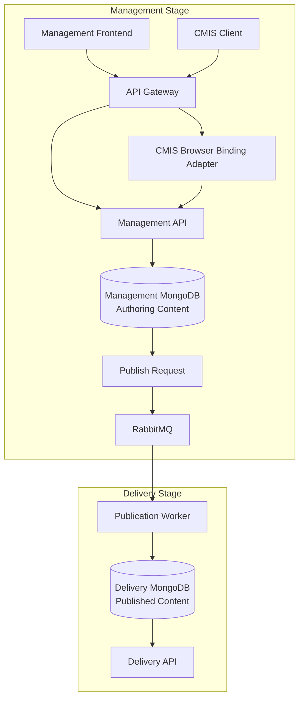

# ECMP Architecture

This document describes the planned architecture for the Enterprise Content Management Platform (ECMP).

The architecture is still evolving. Open decisions are documented explicitly so they can be resolved during the specification phase.

Important architecture decisions are tracked as Architecture Decision Records in [docs/adr](adr/README.md).

## System Context

ECMP is intended to be used by authenticated internal users through the Management Frontend. The platform does not currently expose a public consumer-facing experience or public external API. A planned CMIS compatibility API will allow authenticated enterprise content clients to access the Management Stage through a standards-based adapter without replacing the native ECMP REST APIs.

Human users:

| Actor | Description |
| --- | --- |
| Creator | Content author responsible for creating and editing draft content. |
| Reviewer | Content author responsible for reviewing content before publication. |
| Publisher | Content author responsible for requesting publication and unpublication. |
| Admin | Administrative user responsible for managing users, roles, and platform access. |

Application clients:

| Client | Access |
| --- | --- |
| Management Frontend | Used by content authors and admins over HTTPS. |
| Internal Management API clients | Internal platform clients only. |
| Internal Delivery API clients | Internal platform clients only. |
| CMIS clients | Authenticated standards-based management clients using the planned CMIS Browser Binding compatibility API. |

External systems:

| System | Purpose |
| --- | --- |
| MongoDB | Stores structured content, content schemas, publication state, published content, and document metadata. |
| Redis | Stores sessions and cache data. |
| RabbitMQ | Transports asynchronous publication and unpublication events. |
| Filesystem-backed storage | Stores binary file content through a configured storage path or mounted volume. |

Out of scope for the current architecture:

* Public consumers.
* Public external clients using the Delivery API.
* Unauthenticated public external clients using the Management API.

## High-Level Architecture

ECMP separates content management from content delivery. Content authors and admins use a Management Frontend over HTTPS to create, edit, approve, publish, and unpublish content in the Management Stage. Internal clients read published content from the Delivery Stage through internal APIs. Publication between both stages is asynchronous and event-driven.



Management and Delivery storage are separated at database level. The Management Stage stores authoring content in a management database, while the Delivery Stage stores published content in a delivery database.

Both databases may run on the same MongoDB instance in local or simple environments. For stronger operational isolation, they may also run on separate MongoDB instances.

## Planned Monorepo Structure

The project will use a single repository with multiple independently deployable applications and services.

```text
ecmp-platform/
|-- apps/
|   `-- management-frontend/
|       `-- src/app/
|           |-- core/
|           |-- shared/
|           `-- features/
|               |-- content/
|               |-- content-types/
|               |-- folders/
|               `-- publication/
|
|-- services/
|   |-- api-gateway/
|   |-- identity-service/
|   |-- content-service/
|   |-- publication-service/
|   |-- publication-worker/
|   `-- delivery-service/
|
|-- packages/
|   |-- shared-types/
|   |-- shared-events/
|   |-- shared-auth/
|   `-- shared-yaml/
|
|-- infrastructure/
|   |-- kubernetes/
|   |-- helm/
|   |-- docker/
|   `-- terraform/
|
|-- docs/
`-- .github/
```

Each application and service will be built and deployed independently while sharing common packages for types, events, authentication, and YAML handling.

## Management Frontend

The Management Frontend is the user interface for authenticated content authors and administrators.

Responsibilities:

* Authenticate users through the platform identity flow.
* Manage content types where permitted.
* Browse and manage hierarchical folders.
* Create, read, update, and delete content instances.
* Upload and manage document metadata.
* Request content publication and unpublication.
* Display content lifecycle status.
* Surface validation errors from the backend APIs.

The frontend will communicate with backend services through the API Gateway. It will not access MongoDB, Redis, RabbitMQ, or filesystem storage directly.

Technology:

* Angular
* TypeScript
* Angular Router
* Angular Forms
* Angular HTTP Client

The Management Frontend will follow the same architectural principles as the backend. Feature areas should be organized around business capabilities, such as content, content types, folders, and publication.

Planned feature structure:

```text
features/content/
|-- domain/
|-- application/
|-- infrastructure/
`-- presentation/
```

Layer responsibilities:

| Layer | Responsibility |
| --- | --- |
| Domain | Content entities, value objects, domain rules, and lifecycle constraints. |
| Application | Use cases such as creating content, updating content, publishing content, and unpublishing content. |
| Infrastructure | REST clients, DTO mapping, and API gateway communication. |
| Presentation | Angular components, pages, forms, view models, and UI state. |

### Frontend Architecture

The first Management Frontend implementation should stay focused on the core authoring experience. It will start with a minimal route structure and one main authenticated workspace: the folder explorer.

The Management Frontend will use standalone Angular components and route-based feature areas. New features should not use Angular NgModules unless a future library or third-party integration requires it.

Initial Angular app structure:

```text
src/app/
|-- core/
|   |-- auth/
|   |-- guards/
|   |-- http/
|   `-- layout/
|-- shared/
|   |-- components/
|   |-- forms/
|   `-- ui-state/
`-- features/
    |-- auth/
    |-- content/
    |-- content-types/
    |-- folder-explorer/
    |-- folders/
    `-- publication/
```

Feature area responsibilities:

| Feature area | Responsibility |
| --- | --- |
| `auth` | Login flow, session state, and authentication UI. |
| `folder-explorer` | Composition workspace that coordinates folder, content, file, and publication workflows. |
| `folders` | Folder domain rules, folder use cases, folder API integration, and folder presentation pieces. |
| `content` | Content instance domain rules, content use cases, content API integration, and content presentation pieces. |
| `content-types` | Content type schema management and schema-driven form support. |
| `publication` | Publish and unpublish use cases, request status handling, and publication API integration. |

The `folder-explorer` feature coordinates user workflows but does not own the domain rules for folders, content instances, documents, or publication. Those rules remain in the owning business capability feature areas.

Frontend feature boundaries:

| Layer | Contains | Must not contain |
| --- | --- | --- |
| `domain` | Entities, value objects, domain validation, lifecycle rules, and business invariants. | Angular components, HTTP clients, API DTOs, or UI state. |
| `application` | Use cases such as creating folders, updating content instances, deleting records, publishing, and unpublishing. | DOM logic, direct API response handling, or component-specific state. |
| `infrastructure` | REST clients, DTOs, mappers, API Gateway adapters, and persistence-facing concerns. | Business rules or lifecycle decisions. |
| `presentation` | Angular standalone components, pages, forms, dialogs, view models, and UI state. | Direct backend calls or business mutations that bypass application use cases. |

Each business capability should own its domain, application, infrastructure, and presentation code only where needed. Empty architectural folders are not required during the first implementation.

Initial routes:

| Route | Screen | Access |
| --- | --- | --- |
| `/login` | Login screen | Anonymous users. |
| `/folders` | Folder explorer workspace using the root folder by default. | Authenticated users. |
| `/folders/:folderId` | Folder explorer workspace scoped to a selected folder. | Authenticated users. |
| `/` | Redirect to `/folders` when authenticated, otherwise `/login`. | All users. |
| `/**` | Redirect to `/folders` or show a not-found state. | All users. |

Initial screens:

| Screen | Purpose |
| --- | --- |
| Login | Authenticate a user and start a management session. |
| Folder explorer | Single-page authenticated workspace for browsing folders, viewing content instances, and running management operations. |

The folder explorer should provide a toolbar for the main authoring operations. The first toolbar can include actions for creating folders, renaming folders, deleting folders, creating content instances, updating content instances, deleting or archiving content instances, uploading documents, publishing, and unpublishing.

Folder explorer layout:

| Area | Responsibility |
| --- | --- |
| Toolbar | Primary create, update, delete, publish, and unpublish actions. |
| Folder tree | Hierarchical folder navigation starting from the reserved root folder. |
| Content list | Content instances and documents assigned to the selected folder. |
| Detail panel or modal | Forms for creating and updating folders, content instances, and document metadata. |
| Status area | Validation errors, lifecycle state, publication status, and operation feedback. |

Initial user workflows:

| Workflow | Steps |
| --- | --- |
| Create folder | Select a parent folder, choose create folder, enter a valid folder name, submit, refresh the folder tree. |
| Update folder | Select a folder, choose rename or update, submit the new folder metadata, refresh the folder tree and current path. |
| Delete folder | Select a folder, choose delete, confirm the action, refresh the folder tree according to lifecycle rules. |
| Create content instance | Select a folder, choose create content, select a content type, complete the generated form, submit, show the new record in the selected folder. |
| Update content instance | Select a content instance, edit supported fields, submit changes, increment the content version, refresh the content list. |
| Delete content instance | Select a content instance, choose delete or archive, confirm the action, refresh the content list. |
| Publish content instance | Select an approved content instance, choose publish, create a publication request, show request status and lifecycle feedback. |
| Unpublish content instance | Select a published content instance, choose unpublish, create an unpublication request, show request status and lifecycle feedback. |

The first implementation should avoid deep navigation. Content editing, folder editing, and publication actions can be handled inside the folder explorer through panels, dialogs, or inline forms as long as the feature boundaries remain separated in the Angular code.

## Security Model

The initial security model is role-based and permission-driven. It starts with a small set of roles and resource actions that are enough for the Management Frontend, folder explorer, content CRUD, document management, and publication workflow.

### Roles

Initial roles:

| Role | Description |
| --- | --- |
| Admin | Administrative user with full platform access. |
| Creator | Content author who can create and maintain folders, files, and content instances. |
| Reviewer | Content author who can read folders, files, and content instances before publication. |
| Publisher | Content author who can read content and request publication or unpublication. |

### Permissions

Permissions use a `resource:action` format.

Initial resources:

| Resource | Description |
| --- | --- |
| `explorer` | Management Frontend folder explorer workspace access. |
| `folder` | Folder hierarchy operations. |
| `file` | Document metadata and binary file operations. |
| `<contentTypeName>` | Content instance operations for a specific user-defined content type, such as `generic:read`. |
| `workflow` | Publication and unpublication workflow operations. |
| `content-type` | Content type schema administration. |

Initial actions:

| Action | Description |
| --- | --- |
| `read` | View or retrieve a resource. |
| `create` | Create a new resource. |
| `update` | Modify an existing resource. |
| `delete` | Delete or archive a resource according to lifecycle rules. |
| `*` | All actions for the resource. |

### Role-Permission Mapping

| Role | Permissions |
| --- | --- |
| Admin | All permissions. |
| Creator | `explorer:read`, `folder:*`, `file:*`, `<contentTypeName>:*` |
| Reviewer | `explorer:read`, `folder:read`, `file:read`, `<contentTypeName>:read` |
| Publisher | `explorer:read`, `folder:read`, `file:read`, `<contentTypeName>:read`, `workflow:*` |

The earlier `projects` permission name is represented as `folder` in ECMP because folders are the platform resource used to group content instances.

### Authentication Flow

The first implementation will support username and password authentication only.

Initial JWT-based flow:

1. The user opens the Management Frontend.
2. If there is no valid session or token, the frontend redirects to `/login`.
3. The user submits username or email and password.
4. The Management Frontend sends the credentials to the login endpoint.
5. The Identity Service validates credentials against the identity store.
6. If credentials are valid, the server issues an access token and a refresh token.
7. The client stores the tokens according to the token transport strategy.
8. The frontend redirects the user to the folder explorer.
9. The client includes the access token in subsequent API requests.
10. Authorization middleware validates the access token before protected endpoints are executed.
11. When the access token expires, the client exchanges the refresh token for a new access token.
12. Logout or refresh token expiration ends the authenticated session.
13. If authentication fails, the login screen shows an error without starting a session.

Flow diagram:

```text
Client
  |
  | POST /api/auth/login
  v
Identity Service
  |
  | Validate credentials
  v
Identity Store
  |
  | Credentials valid
  v
Generate tokens
  |-- Access token
  `-- Refresh token
  |
  v
Client stores tokens
  |
  | Requests API with access token
  v
Authorization middleware
  |
  | Validate access token
  v
Protected endpoint
```

### Session and Token Strategy

The initial implementation should use stateless access tokens and stateful refresh tokens.

Initial strategy:

* The Identity Service authenticates username and password credentials.
* A short-lived signed JWT access token is issued after successful login.
* A longer-lived refresh token is issued after successful login.
* Access tokens are stateless and are not stored server-side.
* Refresh tokens are stored server-side so they can be rotated and revoked.
* Refresh tokens should be rotated after every successful refresh.
* Logout invalidates active refresh tokens.
* Inactive sessions expire automatically when their refresh tokens expire.
* The Management Frontend sends the access token with API requests using the `Authorization: Bearer <token>` header.
* The API Gateway or authorization middleware validates the access token on every protected request.
* Backend services should receive trusted identity and permission context from the API Gateway or validate the token according to the final implementation approach.
* HTTPS is required for all authenticated traffic.

Access token characteristics:

| Property | Initial decision |
| --- | --- |
| Purpose | Authenticate API requests. |
| Format | Signed JWT. |
| Lifetime | Short-lived, initially 5 to 30 minutes. |
| Transport | `Authorization: Bearer <token>`. |
| Server-side storage | None. |

Example access token claims:

```json
{
  "sub": "USR-12345",
  "email": "user@example.com",
  "roles": ["Creator"],
  "permissions": [
    "explorer:read",
    "folder:*",
    "file:*",
    "generic:*"
  ],
  "iat": 1712340000,
  "exp": 1712341800
}
```

Refresh token characteristics:

| Property | Initial decision |
| --- | --- |
| Purpose | Obtain new access tokens. |
| Format | Opaque token or signed token, pending implementation. |
| Lifetime | Longer-lived, initially 7 to 30 days. |
| Browser storage | Prefer HttpOnly, Secure, SameSite cookie. |
| Server-side storage | Required for rotation and revocation. |
| Rotation | Rotate after every successful use. |

Refresh token storage may use Redis in the first implementation because Redis is already planned for session-related data.

Token transport can be refined during implementation. The preferred default is an HTTP-only secure cookie for refresh tokens and an `Authorization: Bearer` header for access tokens.

### Authorization Behavior

Every protected endpoint must validate authentication and authorization before executing business logic.

Authorization flow:

1. The request reaches the API Gateway or service authorization middleware.
2. The middleware validates the access token signature and expiration.
3. The middleware extracts user identity, roles, and permissions from token claims.
4. The middleware compares endpoint requirements with the user's permissions.
5. If the token is missing, expired, or invalid, the platform returns `401 Unauthorized`.
6. If the user is authenticated but lacks the required permission, the platform returns `403 Forbidden`.
7. If the permission check passes, the protected endpoint executes.

Example:

```text
GET /api/management/folders/FLD-root

Requires:
  folder:read

Validate JWT
Extract permissions
folder:read exists?
  Yes -> 200 OK
  No  -> 403 Forbidden
```

Frontend route authorization:

| Route | Required permission |
| --- | --- |
| `/login` | Public |
| `/folders` | `explorer:read` |
| `/folders/:folderId` | `explorer:read` and `folder:read` |

### Security Best Practices

Initial best practices:

* Use Role-Based Access Control to simplify permission management.
* Enforce least privilege by granting users only the permissions they need.
* Validate authorization on every protected endpoint.
* Keep access tokens short-lived.
* Keep refresh tokens longer-lived but rotate them after every use.
* Store refresh tokens in secure HttpOnly cookies when possible.
* Support refresh token revocation for logout, compromised accounts, and administrative actions.
* Use HTTPS for all authenticated traffic.
* Return `401 Unauthorized` for missing, expired, or invalid authentication.
* Return `403 Forbidden` for authenticated users lacking the required permission.
* Audit security-sensitive operations such as login attempts, token refreshes, logout, permission changes, role changes, and administrative actions.

## Planned Microservices

### Service Boundaries

Each service owns a specific part of the domain model and should expose that ownership through its API. Other services may read or request changes through published APIs or events, but they should not directly modify another service's owned data.

| Service | Owns |
| --- | --- |
| Identity Service | Authentication, authorization, sessions, users, and role assignments. |
| Content Service | Content drafts, master records, folder hierarchy, content lifecycle state, document metadata, content type schemas, and content type definition objects. |
| Publication Service | Publication and unpublication requests, publication state, and publication events. |
| Publication Worker | Execution of publication and unpublication events between Management and Delivery stages. |
| Delivery Service | Published read model access and internal delivery queries. |
| API Gateway | Request routing, edge authentication integration, and cross-cutting API concerns. |
| CMIS Browser Binding Adapter | Planned standards-based CMIS compatibility layer that maps CMIS requests to existing ECMP management capabilities. |

Ownership rules:

* The Content Service is the source of truth for draft and master content records.
* The Content Service is the source of truth for the folder hierarchy used to organize content instances.
* The Content Service is the source of truth for content type schemas and content type definition objects, which are folder-contained repository objects under the reserved `/system/schemas` namespace (see [Content Type Definitions and the Schema Namespace](#content-type-definitions-and-the-schema-namespace)). A standalone Content Type Service previously owned schemas; that service was merged into the Content Service (see [ADR-0017](adr/0017-merge-content-type-service-into-content-service.md)) so folder occupancy, moves, and deletes stay within one consistency boundary.
* The Publication Service is the source of truth for publication requests.
* The Delivery Service exposes published read models but does not own authoring content.
* The CMIS Browser Binding Adapter does not own data. It translates CMIS requests into existing Content Service and authorization behavior.
* The Identity Service is the source of truth for authentication, authorization, sessions, users, and roles.
* The Publication Worker updates Delivery storage only as part of a publication or unpublication event.

### Initial REST API Contracts

The initial REST API is internal to the platform and primarily consumed by the Management Frontend and internal platform clients. Endpoint paths may be exposed through the API Gateway, while service implementations remain independently deployable.

All management endpoints require authentication. Endpoint authorization uses the permissions defined in the Security Model.

#### Authentication

Owned by the Identity Service.

| Method | Endpoint | Permission | Description |
| --- | --- | --- | --- |
| `POST` | `/api/auth/login` | Anonymous access | Authenticate with username and password and start a session. |
| `POST` | `/api/auth/refresh` | Valid refresh token | Exchange a valid refresh token for a new access token and rotated refresh token. |
| `POST` | `/api/auth/logout` | Authenticated session | End the current session. |
| `GET` | `/api/auth/session` | Authenticated session | Retrieve the current authenticated user, roles, and permissions. |

Initial login payload shape:

```json
{
  "username": "creator@example.com",
  "password": "password"
}
```

Initial refresh behavior:

* The client calls `/api/auth/refresh` when the access token expires or is close to expiring.
* The request must include a valid refresh token.
* The Identity Service validates the refresh token against server-side storage.
* If valid, the Identity Service issues a new access token and rotates the refresh token.
* If invalid, expired, revoked, or reused after rotation, the request fails with `401 Unauthorized`.

#### Content CRUD

Owned by the Content Service.

| Method | Endpoint | Permission | Description |
| --- | --- | --- | --- |
| `GET` | `/api/management/contents` | `<contentTypeName>:read` | List content records from the Management database. |
| `GET` | `/api/management/contents?folderId={folderId}` | `folder:read` and `<contentTypeName>:read` | List content records assigned to a folder. |
| `GET` | `/api/management/contents/{contentId}` | `<contentTypeName>:read` | Retrieve a content record by ID. |
| `POST` | `/api/management/contents` | `<contentTypeName>:create` | Create a new draft content record. |
| `PUT` | `/api/management/contents/{contentId}` | `<contentTypeName>:update` | Replace an existing content record. |
| `PATCH` | `/api/management/contents/{contentId}` | `<contentTypeName>:update` | Partially update an existing content record. |
| `DELETE` | `/api/management/contents/{contentId}` | `<contentTypeName>:delete` | Delete or archive a content record, depending on lifecycle rules. |

Initial create/update payload shape:

```json
{
  "folderId": "FLD-root",
  "contentType": "generic",
  "data": {
    "title": "Welcome",
    "description": "First article",
    "publishDate": "2026-06-01"
  }
}
```

#### Folder CRUD

Owned by the Content Service.

Folders organize content instances into a hierarchical tree. Folder operations are internal management operations used by the Management Frontend.

| Method | Endpoint | Permission | Description |
| --- | --- | --- | --- |
| `GET` | `/api/management/folders` | `folder:read` (`content-type:read` under `/system/schemas`) | List folders, optionally filtered by parent folder. |
| `GET` | `/api/management/folders/{folderId}` | `folder:read` (`content-type:read` under `/system/schemas`) | Retrieve a folder by ID. |
| `POST` | `/api/management/folders` | `folder:create` (`content-type:create` under `/system/schemas`) | Create a new folder under an existing parent folder. |
| `PATCH` | `/api/management/folders/{folderId}` | `folder:update` (`content-type:update` under `/system/schemas`) | Update folder metadata, such as the folder name. |
| `POST` | `/api/management/folders/{folderId}/move` | `folder:update` (`content-type:update` under `/system/schemas`) | Move a folder under a different parent folder. |
| `DELETE` | `/api/management/folders/{folderId}` | `folder:delete` (`content-type:delete` under `/system/schemas`) | Delete or archive a folder according to folder and content lifecycle rules. |
| `GET` | `/api/management/folders/{folderId}/contents` | `folder:read` and `<contentTypeName>:read` | List content records assigned to a folder. |

Folders inside the reserved `/system/schemas` namespace require the matching `content-type:*` permission instead of `folder:*`, since that namespace is schema administration surface, not authoring surface. The reserved `/system` and `/system/schemas` folders themselves reject rename, move, and delete regardless of permission (see [Content Type Definitions and the Schema Namespace](#content-type-definitions-and-the-schema-namespace)).

Initial create/update payload shape:

```json
{
  "name": "folder2",
  "parentFolderId": "FLD-550e8400-e29b-41d4-a716-446655440001"
}
```

Initial response shape:

```json
{
  "folderId": "FLD-550e8400-e29b-41d4-a716-446655440002",
  "name": "folder2",
  "parentFolderId": "FLD-550e8400-e29b-41d4-a716-446655440001",
  "path": "/folder1/folder2",
  "createdAt": "2026-06-01T10:00:00.000Z",
  "updatedAt": "2026-06-01T10:00:00.000Z"
}
```

#### Content Type CRUD

Owned by the Content Service.

| Method | Endpoint | Permission | Description |
| --- | --- | --- | --- |
| `GET` | `/api/management/content-types` | none (open to authoring workflows) | List active content type schema summaries, used to choose a content type when authoring content. |
| `GET` | `/api/management/content-types/{name}` | none (open to authoring workflows) | Retrieve the latest active version of a content type schema. |
| `GET` | `/api/management/content-types/{name}/versions/{version}` | none (open to authoring workflows) | Retrieve a specific content type schema version. |
| `GET` | `/api/management/content-types/definitions?folderId={folderId}` | `content-type:read` | List content type definition objects assigned to a schema folder under `/system/schemas`. Admin-only. |
| `POST` | `/api/management/content-types` | `content-type:create` | Create a new content type schema version, optionally targeting a schema folder via `folderId`. Admin-only. |
| `PUT` | `/api/management/content-types/{name}/versions/{version}` | `content-type:update` | Replace an existing content type schema version. Admin-only. |
| `DELETE` | `/api/management/content-types/{name}/versions/{version}` | `content-type:delete` | Soft deactivate a content type schema version. Admin-only. |
| `POST` | `/api/management/content-types/{name}/move` | `content-type:update` | Move a content type definition object to another schema folder under `/system/schemas`. Admin-only. |

Active schema summary and definition reads are intentionally split: listing/retrieving active schemas by name stays available to authoring workflows so any authenticated user can choose a content type, while schema folder browsing (`/definitions`) and every write remain administrator-only, enforced through the `content-type:*` permissions above.

Initial create/update payload shape:

```json
{
  "name": "generic",
  "version": "1.0",
  "schema": {
    "fields": {
      "title": {
        "type": "string",
        "required": true
      }
    }
  }
}
```

#### Document Metadata Upload and Update

Owned by the Content Service.

The binary file is stored in filesystem-backed storage. The first implementation stores metadata in the Content Service in-memory repository; MongoDB can replace that repository in a later persistence slice. Files are folder-scoped in Phase 3.

| Method | Endpoint | Permission | Description |
| --- | --- | --- | --- |
| `GET` | `/api/management/files?folderId={folderId}` | `file:read` | List document metadata assigned to a folder. |
| `POST` | `/api/management/files` | `file:create` | Upload a binary document and create document metadata using multipart fields `folderId` and `file`. |
| `GET` | `/api/management/files/{fileId}` | `file:read` | Retrieve document metadata by ID. |
| `PATCH` | `/api/management/files/{fileId}` | `file:update` | Update document metadata. |
| `DELETE` | `/api/management/files/{fileId}` | `file:delete` | Delete or archive document metadata and the associated binary file according to lifecycle rules. |

Initial metadata response shape:

```json
{
  "fileId": "STF-550e8400-e29b-41d4-a716-446655440002",
  "folderId": "FLD-root",
  "filename": "manual.pdf",
  "mimeType": "application/pdf",
  "size": 124500,
  "path": "STF-550e8400-e29b-41d4-a716-446655440002.pdf"
}
```

#### Publish Request

Owned by the Publication Service.

| Method | Endpoint | Permission | Description |
| --- | --- | --- | --- |
| `POST` | `/api/management/contents/{contentId}/publication-requests` | `workflow:create` and `<contentTypeName>:read` | Request publication for a content record. |
| `GET` | `/api/management/publication-requests/{requestId}` | `workflow:read` | Retrieve publication request status. |

Initial request payload shape:

```json
{
  "requestedBy": "user-001",
  "reason": "Ready for publication"
}
```

Initial response shape:

```json
{
  "requestId": "pub-001",
  "contentId": "RCD-550e8400-e29b-41d4-a716-446655440000",
  "type": "publish",
  "status": "requested"
}
```

#### Unpublish Request

Owned by the Publication Service.

| Method | Endpoint | Permission | Description |
| --- | --- | --- | --- |
| `POST` | `/api/management/contents/{contentId}/unpublication-requests` | `workflow:create` and `<contentTypeName>:read` | Request unpublication for a content record. |
| `GET` | `/api/management/unpublication-requests/{requestId}` | `workflow:read` | Retrieve unpublication request status. |

Initial request payload shape:

```json
{
  "requestedBy": "user-001",
  "reason": "Content should no longer be available"
}
```

Initial response shape:

```json
{
  "requestId": "unpub-001",
  "contentId": "RCD-550e8400-e29b-41d4-a716-446655440000",
  "type": "unpublish",
  "status": "requested"
}
```

#### Delivery Content Retrieval

Owned by the Delivery Service.

Delivery endpoints are internal read-only APIs backed by the Delivery MongoDB database.

| Method | Endpoint | Permission | Description |
| --- | --- | --- | --- |
| `GET` | `/api/delivery/contents` | Internal client access and `<contentTypeName>:read` | List published content records from the Delivery database. |
| `GET` | `/api/delivery/contents/{contentId}` | Internal client access and `<contentTypeName>:read` | Retrieve a published content record by ID. |
| `GET` | `/api/delivery/contents?contentType={contentType}` | Internal client access and `<contentTypeName>:read` | List published content records by content type. |
| `GET` | `/api/delivery/contents?folderId={folderId}` | Internal client access, `folder:read`, and `<contentTypeName>:read` | List published content records by folder. |

Initial response shape:

```json
{
  "contentId": "RCD-550e8400-e29b-41d4-a716-446655440000",
  "contentType": "generic",
  "version": 1,
  "publishedAt": "2026-06-01T10:00:00.000Z",
  "data": {
    "title": "Welcome",
    "description": "First article",
    "publishDate": "2026-06-01"
  }
}
```

### API Gateway

Single entry point for the Management Frontend and internal platform API clients.

Responsibilities:

* Routing
* Authentication integration
* Rate limiting
* Request forwarding to internal services

### Identity Service

Handles authentication, authorization, and session management.

Ownership:

* Users
* Roles
* Authentication
* Authorization
* Sessions

Storage:

* Redis for session data

### Content Service

Manages content instances, folders, document metadata, content type schemas, and content type definition objects. A standalone Content Type Service originally owned schemas; it was merged into the Content Service (see [ADR-0017](adr/0017-merge-content-type-service-into-content-service.md)) because content type definitions are folder-contained repository objects and folder occupancy, moves, and deletes need to stay inside one transactional/consistency boundary rather than requiring cross-service coordination.

Ownership:

* Content drafts
* Master content records
* Folder hierarchy, including the reserved `/system` and `/system/schemas` namespace
* Content lifecycle state
* Document metadata
* Content type schemas and schema version lifecycle
* Content type definition objects (folder-contained, under `/system/schemas`)

Responsibilities:

* Content CRUD operations
* Folder CRUD operations, including protected-folder and schema-namespace rules
* Content validation
* Content lifecycle management
* Basic content versioning
* Content type schema definition, validation, and YAML parsing
* Schema folder administration and content type definition moves (admin-only)

Storage:

* MongoDB for content metadata, folder metadata, structured content, and content type schemas
* Filesystem-backed storage for binary files

### Publication Service

Coordinates publication and unpublication requests created from the Management Frontend.

Ownership:

* Publication requests
* Unpublication requests
* Publication state
* Publication events

Responsibilities:

* Publication request handling
* Unpublication request handling
* Event generation
* Publication state tracking

Dependencies:

* RabbitMQ
* MongoDB

### Publication Worker

Consumes publication events and projects or removes content between Management and Delivery stages.

Responsibilities:

* Event consumption
* Publish and unpublish execution
* Delivery stage synchronization

Dependencies:

* RabbitMQ
* MongoDB

### Delivery Service

Provides internal read-only content APIs.

Ownership:

* Published read model access
* Internal delivery queries

Responsibilities:

* Published content retrieval
* Internal REST endpoints
* High-performance read operations

Storage:

* Delivery MongoDB database

## Content Model

ECMP uses a schema-driven content architecture. Content types are defined as YAML schemas, and content instances are validated against those schemas before being stored.

Example content type definition:

```yaml
name: generic
version: 1.0

fields:
  - name: title
    type: string
    required: true

  - name: description
    type: string

  - name: publishDate
    type: date
```

Content type schemas define:

* Allowed fields
* Field data types
* Validation rules
* Required fields
* Extensibility rules

### Object-Type Hierarchy

ECMP owns an internal object-type model. Every object type descends from an internal `Object Type` root that is a platform abstraction and is never exposed as a standalone type to external clients. The CMIS Compatibility API is a standards projection of this model rather than its source of truth.

```text
Object Type
  |-- Folder Type
  |    `-- Folder instance
  |-- Document Type
  |    `-- Document instance
  `-- Content Type Definition
       |-- Content type definition object "generic" (repository object under /system/schemas)
       |-- Content type definition object "some-other-type" (repository object under /system/schemas)
       |-- Generic Content Type
       |    `-- Content record instance of Generic
       `-- Some Other User Content Type
            `-- Content record instance of Some Other Type
```

`Document Type` is the object-type/domain name for binary content objects that carry a stored content stream. Existing file storage names and `/api/management/files` routes remain as compatibility and storage details; they do not change the `Document` object-type terminology.

`Content Type Definition` is the common parent of every user-defined content type, and is also the concrete object type of the content type definition object itself. Each user content type such as `generic` has two distinct representations: a folder-contained repository object of type `Content Type Definition`, assigned to a schema folder under `/system/schemas` (see [Content Type Definitions and the Schema Namespace](#content-type-definitions-and-the-schema-namespace)); and a derived user content type (e.g. `ecmp:generic`) whose parent is `Content Type Definition`, referenced by content record instances. Resource instances always reference a concrete type definition — folder instances reference Folder Type, document instances reference Document Type, content type definition objects reference Content Type Definition directly, and content records reference the derived user content type selected at creation — never the internal `Object Type` root directly.

Every object-type definition exposes common, CMIS-compatible attributes: `id`, `localName`, `localNamespace`, `queryName`, `displayName`, `baseId`, `parentId`, `description`, `creatable`, `fileable`, `queryable`, `controllablePolicy`, `controllableACL`, `fulltextIndexed`, `includedInSupertypeQuery`, and `typeMutability`. In this slice the unsupported behavior flags (query, policy, ACL, full-text, and type mutability) are set conservatively to `false`.

### Internal Platform Types

ECMP has internal platform types that are required by the system and are not modeled as user-defined content schemas.

| Type | Object type | Description | Extensibility |
| --- | --- | --- | --- |
| Folder | Folder Type | Internal type used to group content instances into a hierarchical tree. | Cannot be extended by users. |
| Document | Document Type | Internal type used to represent uploaded binary content and its metadata. | Cannot be extended by users. |
| Content type definition | Content Type Definition | Internal parent type used to define schemas for content instances. Each user content type also has a concrete folder-contained instance of this type under `/system/schemas`. | Users (administrators) can create new content type definitions as needed. |

User-defined content types extend the platform by adding schemas for business content, such as articles, landing pages, or product descriptions. They descend from `Content Type Definition` and do not extend the internal Folder or Document types.

### Supported Field Types

Content schemas support a fixed, allowlisted set of field types. Content instance
values are validated against these types without implicit coercion, so each value
must already be the correct JSON type.

| Type | Description | Example |
| --- | --- | --- |
| `string` | Text value stored as a string. | `"Welcome"` |
| `integer` | Whole numeric value without decimal places. | `10` |
| `date` | Calendar date without time information, using ISO `YYYY-MM-DD` format. | `"2026-06-01"` |
| `time` | Time value without date information, using `HH:mm:ss` format. | `"14:30:00"` |
| `boolean` | JSON boolean value. | `true` |
| `datetime` | Timezone-aware RFC 3339 timestamp requiring an explicit `Z` or numeric offset. | `"2026-07-01T14:30:00+02:00"` |
| `decimal` | Finite JSON number, including fractional values. | `4.5` |
| `html` | HTML-formatted text stored as a string source (see security note below). | `"<p>Hello</p>"` |
| `uri` | Syntactically valid absolute URI string. | `"https://example.com/a"` |

Additional field types may be added later when required by the platform.

### Validation Rules

Initial validation should remain simple and explicit.

Common validation rules:

| Rule | Description |
| --- | --- |
| `required` | Indicates whether the field must be present. |
| `type` | Indicates the expected field type. |

Type-specific validation:

| Type | Validation |
| --- | --- |
| `string` | Must be a string value. Empty strings are allowed unless the field is required and empty values are explicitly disallowed later. |
| `integer` | Must be a whole number. Decimal values are invalid. |
| `date` | Must be a valid ISO date using `YYYY-MM-DD` format. |
| `time` | Must be a valid time using `HH:mm:ss` format. |
| `boolean` | Must be a JSON boolean. Strings such as `"true"` are not coerced and are invalid. |
| `datetime` | Must be a timestamp with an explicit timezone: either a trailing `Z` or a numeric `±HH:mm` offset. Timestamps without timezone information are invalid. |
| `decimal` | Must be a finite JSON number. Non-finite values and numeric strings are invalid. |
| `html` | Must be a string. The backend stores the HTML source and does not parse or execute markup. |
| `uri` | Must be a syntactically valid absolute URI (parseable by the platform URL parser). Relative or scheme-less references are invalid. |

> **HTML rendering security constraint.** An `html` field value is stored and
> transported as untrusted text source, not as trusted DOM markup. The backend
> never parses or executes it, and authoring surfaces edit it as plain text in a
> textarea. Any surface that later renders an `html` value as markup MUST pass it
> through a controlled sanitization step before inserting it into the DOM;
> rendering stored HTML directly (for example via `innerHTML` or Angular's
> `bypassSecurityTrust*` APIs) would introduce a stored XSS vulnerability.

Example validation error shape:

```json
{
  "field": "publishDate",
  "code": "INVALID_DATE",
  "message": "publishDate must be a valid date using YYYY-MM-DD format."
}
```

### Required and Optional Fields

Fields are optional by default.

If a field has `required: true`, content instances must provide a value for that field.

Example:

```yaml
fields:
  - name: title
    type: string
    required: true

  - name: description
    type: string
```

In this example, `title` is required and `description` is optional.

### Global ID Strategy

Content records, folders, documents, and content type definitions will use globally unique identifiers generated by the platform.

Initial rules:

* The platform generates all record identifiers.
* Global IDs must be unique across records of the same internal type.
* IDs remain stable for the lifetime of the record.
* Content type names are not part of the uniqueness boundary.
* UUID v4 is the initial recommended value for the global ID suffix.
* Content instance IDs use the `RCD-` prefix.
* Folder IDs use the `FLD-` prefix.
* Document IDs use the `STF-` compatibility prefix.
* Content type definition object IDs use the `CTD-` prefix.
* The root folder `/` has a reserved folder ID.
* The `/system` and `/system/schemas` folders have reserved folder IDs.

Example:

```text
contentId: RCD-550e8400-e29b-41d4-a716-446655440000
folderId: FLD-550e8400-e29b-41d4-a716-446655440001
fileId: STF-550e8400-e29b-41d4-a716-446655440002
contentTypeDefinitionId: CTD-550e8400-e29b-41d4-a716-446655440003
rootFolderId: FLD-root
systemFolderId: FLD-system
systemSchemasFolderId: FLD-system-schemas
```

Some examples in this document may use readable placeholder identifiers to keep the documentation easy to follow, but implementation payloads should use prefixed global IDs.

### Content Instance Metadata

Content instances store system metadata separately from user-defined content data.

Initial content metadata fields:

| Field | Description |
| --- | --- |
| `contentId` | Globally unique content instance identifier generated by the platform, using the `RCD-` prefix. |
| `folderId` | Folder that contains the content instance, using the `FLD-` prefix. |
| `contentType` | User-defined content type schema name. |
| `status` | Current content lifecycle state. |
| `version` | Current integer content version. |
| `createdAt` | UTC timestamp when the content record was created. |
| `updatedAt` | UTC timestamp when the content record was last updated. |

The `folderId` field tracks where the content instance belongs in the folder tree. A content instance may be assigned to the reserved root folder when it is not placed in a child folder.

### Folder Model

Folders group content instances into a hierarchical tree similar to a filesystem directory structure.

Initial folder fields:

| Field | Description |
| --- | --- |
| `folderId` | Globally unique folder identifier generated by the platform, using the `FLD-` prefix. |
| `name` | Folder display name and path segment. |
| `parentFolderId` | Parent folder ID. The root folder uses a reserved ID and has no regular parent. |
| `path` | Materialized folder path, such as `/folder1/folder2`. |
| `createdAt` | UTC timestamp when the folder was created. |
| `updatedAt` | UTC timestamp when the folder was last updated. |

Root folder rules:

* The root folder path is `/`.
* The root folder has a reserved ID: `FLD-root`.
* User-created folders must have a valid parent folder ID.
* Folder paths are derived from parent folder paths and folder names.

Folder validation rules:

* Folder names must follow filesystem-like validation rules.
* Folder names must not be empty.
* Folder names must not contain path separators such as `/` or `\`.
* Folder names must not be `.` or `..`.
* Folder names must not contain control characters.
* Folder names should avoid symbols that are invalid or unsafe on common filesystems.
* Folder names must be unique within the same parent folder.

Exact forbidden symbol lists may be refined during implementation based on the target operating systems and storage strategy.

Protected system folders:

* The root folder plus two reserved administrative folders, `/system` (`FLD-system`) and `/system/schemas` (`FLD-system-schemas`), are seeded on startup.
* `/system` and `/system/schemas` reject rename, move, and delete regardless of caller permission — they are structural, not merely permission-gated.
* Normal content records and documents cannot be created directly in `/system`, `/system/schemas`, or any schema folder beneath it; those namespaces are administrative, not authoring destinations.
* Schema subfolders created by administrators under `/system/schemas` are ordinary folders otherwise: they can be renamed, moved (as long as they stay within `/system/schemas`), and deleted once empty. See [Content Type Definitions and the Schema Namespace](#content-type-definitions-and-the-schema-namespace).

### Content Type Definitions and the Schema Namespace

Content type definitions are folder-contained repository objects, not a flat registry. Each user content type (e.g. `article`) is represented by one content type definition object that groups every schema version sharing that name; administrators move the definition as a whole rather than moving individual schema versions independently.

Content type definition fields:

| Field | Description |
| --- | --- |
| `contentTypeDefinitionId` | Globally unique content type definition identifier generated by the platform, using the `CTD-` prefix. |
| `folderId` | The schema folder that owns this definition, always a descendant of (or equal to) `/system/schemas`. |
| `name` | The content type name shared by all grouped schema versions. |
| `versions` | The schema version summaries (`name`, `version`, `active`) grouped under this definition. |
| `createdAt` / `updatedAt` | UTC timestamps for the definition object. |

Rules:

* Every content type definition is assigned to a folder under `/system/schemas`; creating or moving a definition outside that namespace is rejected as a conflict.
* Administrators can create, rename, move, and delete schema subfolders under `/system/schemas`, and move content type definitions between those subfolders, without changing the definition's name or its schema versions.
* A schema folder cannot be deleted while it still contains child folders or content type definition objects — content type definitions count toward folder occupancy the same way content records and documents do.
* Schema folder browsing (listing definitions, creating schema subfolders, moving definitions, and all schema version writes) requires the `content-type:*` administrator permission. Listing/retrieving active schema summaries by name stays open to authoring workflows so any authenticated user can choose a content type when creating content — administration and consumption are deliberately separate concerns.
* CMIS navigation does not expose `/system/schemas` or content type definition repository objects as browsable folder children, object lookups, or path lookups; CMIS type discovery continues to list active user content types as `ecmp:<name>` custom types (see [CMIS Compatibility API](#cmis-compatibility-api)).

### Basic Versioning

The first implementation will use simple integer-based content versioning.

Initial rules:

* A new content record starts at version `1`.
* Each successful content update increments the version by `1`.
* `contentId` remains stable across all versions.
* Publication requests target a specific `contentId` and `contentVersion`.
* Delivery projections store the published `contentVersion`.
* Publishing the same `contentId` and `contentVersion` more than once must be idempotent.
* Advanced revision history can be added later as a future enhancement.

Example:

```json
{
  "contentId": "RCD-550e8400-e29b-41d4-a716-446655440000",
  "folderId": "FLD-root",
  "contentType": "generic",
  "version": 3,
  "status": "approved",
  "data": {}
}
```

### Document Metadata Fields

The first implementation stores only minimal document metadata in the Content Service in-memory repository. Binary content is stored in filesystem-backed storage rooted at `STATIC_FILE_STORAGE_ROOT`, defaulting to `.ecmp-static-files` under the service process working directory when the environment variable is not set.

Filesystem-backed writes use a private `.tmp` directory under the same storage root before moving completed uploads to their generated final storage path. Stored paths remain internal relative paths based on the generated `STF-` ID rather than client-supplied filenames or public URLs.

Because Phase 3 metadata is in-memory while binaries are durable on disk, service restarts can leave orphaned local binary files until the MongoDB metadata persistence slice is added. In local development, these orphaned files can be removed from the configured storage root when resetting the scaffold.

Initial document metadata fields:

| Field | Description |
| --- | --- |
| `fileId` | Globally unique document identifier generated by the platform, using the `STF-` compatibility prefix. |
| `folderId` | Folder that contains the document, using the `FLD-` prefix. |
| `filename` | Original or normalized file name. |
| `mimeType` | MIME type detected or provided during upload. |
| `size` | File size in bytes. |
| `path` | Internal filesystem-backed storage path. |
| `createdAt` | UTC timestamp when the document metadata was created. |
| `updatedAt` | UTC timestamp when the document metadata was last updated. |

Example:

```json
{
  "fileId": "STF-550e8400-e29b-41d4-a716-446655440002",
  "folderId": "FLD-root",
  "filename": "manual.pdf",
  "mimeType": "application/pdf",
  "size": 124500,
  "path": "STF-550e8400-e29b-41d4-a716-446655440002.pdf",
  "createdAt": "2026-06-01T10:00:00.000Z",
  "updatedAt": "2026-06-01T10:00:00.000Z"
}
```

## Initial Platform and Content Types

The first platform version will include internal platform types plus user-defined content types.

### Generic Content Type

Generic content is the first example of a user-defined content type. It represents structured editorial content.

Example use cases:

* Articles
* Landing pages
* Product descriptions
* Corporate information

Example:

```yaml
id: RCD-550e8400-e29b-41d4-a716-446655440000
folderId: FLD-root
type: generic
title: Welcome
description: First article
publishDate: 2026-06-01
```

### Document Type

Document is an internal platform type used to represent binary assets. The binary file will be stored in a configured filesystem-backed storage location, while the first implementation stores metadata in the Content Service in-memory repository. Users cannot extend the Document type.

Example use cases:

* PDFs
* Images
* Documents
* Videos

Example metadata:

```yaml
id: STF-550e8400-e29b-41d4-a716-446655440002
folderId: FLD-root
type: document
filename: manual.pdf
mimeType: application/pdf
size: 124500
path: STF-550e8400-e29b-41d4-a716-446655440002.pdf
```

### Folder Type

Folder is an internal platform type used to organize content instances. Users cannot extend the Folder type.

Example:

```yaml
id: FLD-550e8400-e29b-41d4-a716-446655440001
name: folder1
parentFolderId: FLD-root
path: /folder1
createdAt: 2026-06-01T10:00:00.000Z
updatedAt: 2026-06-01T10:00:00.000Z
```

## Content Lifecycle

Content will move through the following lifecycle states:

| State | Description |
| --- | --- |
| Draft | Content is being edited. |
| Approved | Content is ready for publication. |
| Publishing | A publication request is being processed. |
| Published | Content is available in the Delivery Stage. |
| Unpublished | Content has been removed from the Delivery Stage. |
| Archived | Content remains stored but is no longer active. |

## Publication Workflow

Publication must be asynchronous.

### Publication Strategy

ECMP will use projection-based publication.

In this strategy, the Publication Worker does not copy the Management content document directly into the Delivery database. Instead, it transforms the authoring content into a Delivery read model designed for internal read-only consumption.

The first implementation should keep the projection simple. The goal is to establish a clean separation between Management and Delivery without introducing a complex projection engine too early.

Initial delivery projection shape:

```json
{
  "contentId": "RCD-550e8400-e29b-41d4-a716-446655440000",
  "folderId": "FLD-root",
  "contentType": "generic",
  "version": 1,
  "publishedAt": "2026-06-01T10:00:00.000Z",
  "data": {
    "title": "Welcome",
    "description": "First article",
    "publishDate": "2026-06-01"
  }
}
```

Projection rules:

* Only fields intended for delivery should be written into the Delivery database.
* Authoring-only metadata, workflow state, and management permissions must stay in the Management database.
* Folder identity may be included in the Delivery projection when internal delivery clients need to query or display content by folder.
* The Delivery model may evolve independently from the Management model.
* The first projection should preserve the validated content `data` structure unless a content type requires delivery-specific transformation.
* Projection logic should be covered by unit and integration tests.

### Retry Behavior

Publication and unpublication will not use automatic retries in the initial implementation.

If a publish or unpublish operation fails, the platform records the failure and notifies the user through the Management Frontend. A publisher can retry the operation manually after reviewing the error.

Initial retry rules:

* Failed publication requests remain visible in the Management Frontend.
* Failed unpublication requests remain visible in the Management Frontend.
* The Publication Worker does not automatically retry failed operations.
* Manual retry creates a new publication or unpublication attempt linked to the original request.
* Retry behavior may be expanded later if operational requirements justify automatic retries.

### Failure States

The initial workflow will start with simple failure states. More detailed states may be added later as the publication workflow becomes more sophisticated.

Initial publication request states:

| State | Description |
| --- | --- |
| `requested` | The publication or unpublication request has been created. |
| `processing` | The Publication Worker is processing the request. |
| `completed` | The request completed successfully. |
| `failed` | The request failed and requires manual review or retry. |

Content lifecycle states remain separate from request states. For example, a content item may remain `Approved` if publication fails before it reaches the Delivery Stage.

### Idempotency Rules

Publishing and unpublishing must be idempotent.

The Publication Worker should be able to safely receive the same event more than once without creating duplicate Delivery records, corrupting Delivery data, or incorrectly changing the final content state.

Initial idempotency rules:

* Publication events must include stable identifiers such as `eventId`, `publicationRequestId`, `contentId`, and `contentVersion`.
* Unpublication events must include stable identifiers such as `eventId`, `unpublicationRequestId`, `contentId`, and `contentVersion`.
* Publishing the same `contentId` and `contentVersion` more than once should result in the same Delivery projection.
* Unpublishing content that is already absent from Delivery should be treated as a successful no-op.
* The Delivery projection should be upserted by stable content identity, not blindly inserted.
* Processed event or request identifiers should be stored so duplicate events can be detected.

### Transactional Safety

Publishing and unpublishing should use transactional operations where possible to avoid incomplete changes when an error occurs halfway through the workflow.

Initial transactional rules:

* A publication operation must not leave a partially written Delivery projection.
* An unpublication operation must not leave a partially removed Delivery projection.
* Delivery database changes and publication request state changes should be committed atomically where the infrastructure supports it.
* If a transaction fails, the request should move to `failed` and the Management Frontend should show the error.
* Failure events should be emitted only after the failed state is recorded.

### Transaction and Event Publishing Model

ECMP will use a combination of database transactions and event publishing.

MongoDB transactions should protect state changes inside the platform databases. RabbitMQ events should be published after the related database transaction commits successfully. The system should not assume that MongoDB writes and RabbitMQ publishing are part of one distributed transaction.

Initial consistency rules:

* The Publication Service creates or updates a publication request inside a database transaction.
* After the transaction commits, the Publication Service publishes the corresponding `content.publish.requested` or `content.unpublish.requested` event.
* The Publication Worker applies Delivery database changes inside a database transaction.
* After the worker transaction commits, the Publication Worker publishes `content.published`, `content.unpublished`, `content.publish.failed`, or `content.unpublish.failed`.
* If the database transaction fails, no event should be published for that failed transaction.
* If event publishing fails after a successful transaction, the request should remain visible for manual review and retry.
* Event publishing failures should be logged with the `correlationId` and request identifier.
* A future implementation may introduce an outbox pattern if stronger delivery guarantees are required.

Publishing process:

1. An author requests publication.
2. The content status changes to `Publishing`.
3. A publication event is sent to RabbitMQ.
4. The Publication Worker consumes the event.
5. The content is projected into the Delivery Stage.
6. The content status changes to `Published`.

Unpublishing process:

1. An author requests unpublication.
2. An unpublication event is sent to RabbitMQ.
3. The Publication Worker consumes the event.
4. The content is removed from the Delivery Stage.
5. The content status changes to `Unpublished`.

Example events:

```text
content.publish.requested
content.published
content.publish.failed
content.unpublish.requested
content.unpublished
content.unpublish.failed
```

### Publication Event Payload Templates

Publication events should use a consistent envelope so producers and consumers can handle tracing, retries, idempotency, and future schema evolution in the same way.

Base event envelope:

```json
{
  "eventId": "evt-001",
  "eventType": "content.publish.requested",
  "eventVersion": "1.0",
  "occurredAt": "2026-06-01T10:00:00.000Z",
  "correlationId": "corr-001",
  "causationId": "request-001",
  "source": "publication-service",
  "data": {}
}
```

Common envelope fields:

| Field | Description |
| --- | --- |
| `eventId` | Unique event identifier. |
| `eventType` | Event name, such as `content.publish.requested`. |
| `eventVersion` | Payload schema version. |
| `occurredAt` | UTC timestamp when the event occurred. |
| `correlationId` | Identifier used to trace the full workflow. |
| `causationId` | Identifier of the request, command, or event that caused this event. |
| `source` | Service that emitted the event. |
| `data` | Event-specific payload. |

#### Publish Requested

Emitted by the Publication Service when a publisher requests content publication.

```json
{
  "eventId": "evt-publish-requested-001",
  "eventType": "content.publish.requested",
  "eventVersion": "1.0",
  "occurredAt": "2026-06-01T10:00:00.000Z",
  "correlationId": "corr-RCD-550e8400-e29b-41d4-a716-446655440000-publication",
  "causationId": "pub-001",
  "source": "publication-service",
  "data": {
    "publicationRequestId": "pub-001",
    "contentId": "RCD-550e8400-e29b-41d4-a716-446655440000",
    "folderId": "FLD-root",
    "contentType": "generic",
    "contentVersion": 1,
    "requestedBy": "user-001",
    "requestedByRole": "publisher",
    "reason": "Ready for publication",
    "managementDatabase": "ecmp_management",
    "deliveryDatabase": "ecmp_delivery"
  }
}
```

#### Published

Emitted after the Publication Worker successfully projects content into the Delivery Stage.

```json
{
  "eventId": "evt-published-001",
  "eventType": "content.published",
  "eventVersion": "1.0",
  "occurredAt": "2026-06-01T10:00:05.000Z",
  "correlationId": "corr-RCD-550e8400-e29b-41d4-a716-446655440000-publication",
  "causationId": "evt-publish-requested-001",
  "source": "publication-worker",
  "data": {
    "publicationRequestId": "pub-001",
    "contentId": "RCD-550e8400-e29b-41d4-a716-446655440000",
    "folderId": "FLD-root",
    "contentType": "generic",
    "contentVersion": 1,
    "publishedAt": "2026-06-01T10:00:05.000Z",
    "deliveryRecordId": "RCD-550e8400-e29b-41d4-a716-446655440000",
    "deliveryDatabase": "ecmp_delivery"
  }
}
```

#### Publish Failed

Emitted when the Publication Worker cannot complete publication.

```json
{
  "eventId": "evt-publish-failed-001",
  "eventType": "content.publish.failed",
  "eventVersion": "1.0",
  "occurredAt": "2026-06-01T10:00:05.000Z",
  "correlationId": "corr-RCD-550e8400-e29b-41d4-a716-446655440000-publication",
  "causationId": "evt-publish-requested-001",
  "source": "publication-worker",
  "data": {
    "publicationRequestId": "pub-001",
    "contentId": "RCD-550e8400-e29b-41d4-a716-446655440000",
    "folderId": "FLD-root",
    "contentType": "generic",
    "contentVersion": 1,
    "failureCode": "DELIVERY_PROJECTION_FAILED",
    "failureMessage": "Unable to project content into the Delivery database.",
    "automaticRetry": false,
    "manualRetryAllowed": true,
    "attempt": 1
  }
}
```

#### Unpublish Requested

Emitted by the Publication Service when a publisher requests content removal from the Delivery Stage.

```json
{
  "eventId": "evt-unpublish-requested-001",
  "eventType": "content.unpublish.requested",
  "eventVersion": "1.0",
  "occurredAt": "2026-06-01T11:00:00.000Z",
  "correlationId": "corr-RCD-550e8400-e29b-41d4-a716-446655440000-unpublication",
  "causationId": "unpub-001",
  "source": "publication-service",
  "data": {
    "unpublicationRequestId": "unpub-001",
    "contentId": "RCD-550e8400-e29b-41d4-a716-446655440000",
    "folderId": "FLD-root",
    "contentType": "generic",
    "contentVersion": 1,
    "requestedBy": "user-001",
    "requestedByRole": "publisher",
    "reason": "Content should no longer be available",
    "deliveryDatabase": "ecmp_delivery"
  }
}
```

#### Unpublished

Emitted after the Publication Worker successfully removes content from the Delivery Stage.

```json
{
  "eventId": "evt-unpublished-001",
  "eventType": "content.unpublished",
  "eventVersion": "1.0",
  "occurredAt": "2026-06-01T11:00:05.000Z",
  "correlationId": "corr-RCD-550e8400-e29b-41d4-a716-446655440000-unpublication",
  "causationId": "evt-unpublish-requested-001",
  "source": "publication-worker",
  "data": {
    "unpublicationRequestId": "unpub-001",
    "contentId": "RCD-550e8400-e29b-41d4-a716-446655440000",
    "folderId": "FLD-root",
    "contentType": "generic",
    "contentVersion": 1,
    "unpublishedAt": "2026-06-01T11:00:05.000Z",
    "deliveryRecordId": "RCD-550e8400-e29b-41d4-a716-446655440000",
    "deliveryDatabase": "ecmp_delivery"
  }
}
```

#### Unpublish Failed

Emitted when the Publication Worker cannot complete unpublication.

```json
{
  "eventId": "evt-unpublish-failed-001",
  "eventType": "content.unpublish.failed",
  "eventVersion": "1.0",
  "occurredAt": "2026-06-01T11:00:05.000Z",
  "correlationId": "corr-RCD-550e8400-e29b-41d4-a716-446655440000-unpublication",
  "causationId": "evt-unpublish-requested-001",
  "source": "publication-worker",
  "data": {
    "unpublicationRequestId": "unpub-001",
    "contentId": "RCD-550e8400-e29b-41d4-a716-446655440000",
    "folderId": "FLD-root",
    "contentType": "generic",
    "contentVersion": 1,
    "failureCode": "DELIVERY_REMOVAL_FAILED",
    "failureMessage": "Unable to remove content from the Delivery database.",
    "automaticRetry": false,
    "manualRetryAllowed": true,
    "attempt": 1
  }
}
```

Payload fields may be refined when the publication retry strategy, failure handling, and idempotency rules are finalized.

## Data Storage

| Component | Storage |
| --- | --- |
| Authoring structured content | Management MongoDB database |
| Published structured content | Delivery MongoDB database |
| Content type schemas | Management MongoDB database |
| Folder metadata | Management MongoDB database |
| Folder metadata | Delivery MongoDB database, when folder information is projected for internal delivery queries |
| Document metadata | Content Service in-memory repository for the Phase 3 scaffold; Management MongoDB database in a later persistence slice |
| Document metadata | Delivery MongoDB database only when documents are projected in a future delivery slice |
| Binary files | Management Filesystem-backed storage path or mounted volume |
| Binary files | Delivery Filesystem-backed storage path or mounted volume |
| Sessions | Redis |
| Cache | Redis |
| Publication events | RabbitMQ |

Management and Delivery data must not share the same MongoDB collections. The minimum separation is two databases in one MongoDB instance. A stronger deployment may use one MongoDB instance for Management and another MongoDB instance for Delivery.

### Content Collection

```json
{
  "_id": "...",
  "contentId": "RCD-550e8400-e29b-41d4-a716-446655440000",
  "folderId": "FLD-root",
  "contentType": "generic",
  "status": "published",
  "version": 1,
  "data": {},
  "createdAt": "2026-06-01T10:00:00.000Z",
  "updatedAt": "2026-06-01T10:00:00.000Z"
}
```

### Folder Collection

```json
{
  "_id": "...",
  "folderId": "FLD-550e8400-e29b-41d4-a716-446655440001",
  "name": "folder1",
  "parentFolderId": "FLD-root",
  "path": "/folder1",
  "createdAt": "2026-06-01T10:00:00.000Z",
  "updatedAt": "2026-06-01T10:00:00.000Z"
}
```

### Content Type Collection

Individual schema versions remain stored per `name + version`, but are grouped under one folder-contained content type definition object per content type name (see [Content Type Definitions and the Schema Namespace](#content-type-definitions-and-the-schema-namespace)).

```json
{
  "_id": "...",
  "name": "generic",
  "version": "1.0",
  "active": true,
  "schema": {}
}
```

### Content Type Definition Collection

```json
{
  "_id": "...",
  "contentTypeDefinitionId": "CTD-550e8400-e29b-41d4-a716-446655440003",
  "folderId": "FLD-system-schemas",
  "name": "generic",
  "versions": [
    { "name": "generic", "version": "1.0", "active": true }
  ],
  "createdAt": "2026-06-01T10:00:00.000Z",
  "updatedAt": "2026-06-01T10:00:00.000Z"
}
```

### Document Metadata

```json
{
  "fileId": "STF-550e8400-e29b-41d4-a716-446655440002",
  "folderId": "FLD-root",
  "filename": "manual.pdf",
  "mimeType": "application/pdf",
  "size": 124500,
  "path": "STF-550e8400-e29b-41d4-a716-446655440002.pdf",
  "createdAt": "2026-06-01T10:00:00.000Z",
  "updatedAt": "2026-06-01T10:00:00.000Z"
}
```

## Technology Stack

| Layer | Technology |
| --- | --- |
| Frontend | Angular |
| Language | TypeScript |
| Runtime | Node.js |
| Backend framework | NestJS |
| Frontend framework | Angular |
| Database | MongoDB |
| Cache | Redis |
| Messaging | RabbitMQ |
| File storage | Filesystem-backed storage |
| Containerization | Docker |
| Orchestration | Kubernetes |
| API | REST |
| Compatibility API | CMIS 1.1 Browser Binding |
| Schema definition | YAML |
| Content definition | YAML |

REST will be the initial and primary API style. CMIS 1.1 Browser Binding will be introduced as a standards-based compatibility layer over the Management Stage for authenticated enterprise content clients. GraphQL may be considered later as a future enhancement.

### CMIS Compatibility API

The compatibility layer targets the OASIS [Content Management Interoperability Services (CMIS) Version 1.1](https://docs.oasis-open.org/cmis/CMIS/v1.1/os/CMIS-v1.1-os.html) standard (OASIS Standard, 2013), specifically its Browser Binding. Type definitions, base types, common object-type attributes, and error codes described below follow the CMIS 1.1 specification.

CMIS support is planned as an adapter over ECMP's native management capabilities. It should expose one management repository first, representing the Management Stage authoring repository.

CMIS type definitions are projected from the ECMP object-type hierarchy. The internal `Object Type` root is not advertised as a CMIS base type, and the unsupported optional base types (`cmis:relationship`, `cmis:policy`, `cmis:secondary`) are never advertised.

| ECMP object type | CMIS type | CMIS base type | CMIS parent type |
| --- | --- | --- | --- |
| Object Type (internal root) | not projected | — | — |
| Folder Type | `cmis:folder` | `cmis:folder` | none |
| Document Type | `cmis:document` | `cmis:document` | none |
| Content Type Definition | `ecmp:content-type-definition` | `cmis:item` | `cmis:item` |
| User content type (e.g. `generic`) | `ecmp:<name>` (e.g. `ecmp:generic`) | `cmis:item` | `ecmp:content-type-definition` |

Initial CMIS object mapping:

| CMIS concept | ECMP concept |
| --- | --- |
| Repository | ECMP Management Stage repository |
| `cmis:folder` | Folder instance (Folder Type) |
| `cmis:document` | Document instance with binary content stream (Document Type, file storage) |
| `cmis:item` | Base object type for structured content records |
| `ecmp:content-type-definition` | Content Type Definition, the common parent of user-defined content types |
| Custom CMIS type (`ecmp:<name>`) | User-defined content type schema, exposed as an `ecmp:content-type-definition` descendant |
| Object ID | Existing ECMP global ID such as `FLD-*`, `STF-*`, or `RCD-*` |
| Allowable actions | Existing RBAC permissions and object lifecycle constraints |

Structured content records map to custom object types with `cmis:item` as their base type, so CMIS type discovery advertises `cmis:folder`, `cmis:document`, `cmis:item`, `ecmp:content-type-definition`, and the active ECMP custom content types. Every returned object-type definition exposes the CMIS 1.1 common object-type attributes (identity, hierarchy, display, behavior flags, indexing flags, and type mutability) with conservative defaults: base types use `parentId: null`, `ecmp:content-type-definition` uses `parentId: cmis:item`, custom content types use `parentId: ecmp:content-type-definition`, and `queryable`, `controllablePolicy`, `controllableACL`, `fulltextIndexed`, `includedInSupertypeQuery`, and all `typeMutability` flags stay `false` while the matching CMIS services are unsupported. The optional base types `cmis:relationship`, `cmis:policy`, and `cmis:secondary` are not advertised until ECMP has backing domain behavior for them.

Type discovery is the only place `ecmp:content-type-definition` and the active user content types are exposed. The `/system/schemas` namespace and the folder-contained content type definition repository objects within it (as opposed to the type metadata they define) are not exposed through CMIS navigation: they are excluded from folder children responses, and object lookup by ID or by path under `/system/schemas` returns a CMIS not-found response. Schema administration is an authenticated management-UI concern, not a CMIS-browsable one.

The first CMIS slice should target Browser Binding operations for repository discovery, type discovery, folder children, object lookup by ID, object lookup by path, document content stream retrieval, folder creation, document creation (document-backed), and supported object deletion.

Out of scope for the initial CMIS slice:

* AtomPub and Web Services bindings.
* CMIS query and changelog services.
* Relationships, policies, renditions, retentions, and holds.
* Checkout/checkin and full CMIS versioning services.
* Multifiling, unfiling, and ACL mutation.
* Full CMIS conformance certification.

## Implementation Guidelines

All implementation work should follow the same engineering practices across frontend, backend services, and shared packages.

### Clean Architecture

Business capabilities should be organized around explicit boundaries:

| Layer | Responsibility |
| --- | --- |
| Domain | Entities, value objects, invariants, validation rules, and business errors. |
| Application | Use cases, orchestration, ports, and transaction boundaries. |
| Infrastructure | Database repositories, message brokers, filesystem access, external clients, and framework adapters. |
| Presentation | REST controllers, Angular components, DTOs, request/response mapping, and UI state. |

Initial rules:

* Domain code must not depend on NestJS, Angular, MongoDB, RabbitMQ, filesystem APIs, or HTTP concerns.
* Application use cases should depend on interfaces/ports instead of concrete infrastructure.
* Infrastructure should implement application or domain ports.
* Presentation should translate transport-specific input/output into application calls.
* Shared packages should expose stable types and utilities, not service-specific business flows.

### Test-Driven Development

New behavior should be developed test-first where practical.

TDD expectations:

* Write focused failing tests before implementing domain rules and application use cases.
* Keep domain and application tests fast and independent from infrastructure.
* Add integration tests when persistence, messaging, filesystem, or HTTP boundaries are introduced.
* Do not consider a feature complete if its domain rules, use cases, and API contracts are untested.

### BDD Test Style

Behavior tests should use clear GIVEN-WHEN-THEN wording in test names when it improves readability.

Example:

```text
GIVEN a valid YAML schema WHEN it is parsed THEN it returns a normalized schema
```

Guidelines:

* Use behavior-focused names instead of implementation-focused names.
* Prefer observable outcomes over internal implementation details.
* Keep one main behavior per test.
* Cover success, validation failure, authorization failure, and important edge cases.

### OWASP Top 10 Alignment

Security-sensitive implementation work should consider the OWASP Top 10 by default.

Initial rules:

* Validate and normalize all external input at system boundaries.
* Use allowlists for accepted enum values, schema keys, resource names, and actions.
* Enforce authentication and authorization before protected use cases execute.
* Avoid leaking stack traces, filesystem paths, secrets, tokens, or implementation details in API errors.
* Avoid unsafe dynamic execution, prototype pollution, deserialization surprises, and implicit type coercion.
* Apply size limits to request bodies, uploaded files, YAML schemas, and message payloads.
* Log security-relevant events without logging secrets or sensitive personal data.
* Keep dependencies pinned through the workspace lockfile and review security updates regularly.

## Testing Architecture

The project will follow a test-driven development approach where practical, especially for domain rules, application use cases, validation logic, and publication workflows.

Testing expectations are defined by layer. Percentages are minimum expected coverage targets for the first implementation and should be enforced in CI once the corresponding code exists.

Minimum expected tests per layer:

| Layer | Minimum target | Scope |
| --- | --- | --- |
| Domain unit tests | 100% | Entities, value objects, validation rules, content lifecycle rules, folder rules, ID rules, and publication domain rules. |
| Application use case tests | 100% | Use cases such as creating folders, updating content instances, deleting records, uploading document metadata, publishing, unpublishing, login, and token refresh. |
| Service integration tests | 30% | Service behavior with real or test infrastructure dependencies such as MongoDB, Redis, RabbitMQ, and filesystem-backed storage. |
| API contract tests | 100% | REST and CMIS request and response contracts, status codes, authentication requirements, authorization requirements, and error shapes. |
| Angular component/integration tests | 20% | Components, forms, route guards, frontend use case integration, API client mapping, and folder explorer interactions. |
| Playwright E2E workflows | 10% | Critical browser workflows across the Management Frontend and APIs. |

Coverage rules:

* Domain and application layers must be fully covered because they contain business rules and use cases.
* API contract tests must cover every documented REST or CMIS endpoint before the endpoint is considered complete.
* Integration, Angular, and E2E targets start lower because they are more expensive to maintain and should focus on the highest-risk behavior first.
* Coverage targets should increase later as the platform stabilizes.
* A feature should not be considered complete if its domain rules, use cases, or API contracts are missing tests.

Planned testing tools:

| Test type | Tooling |
| --- | --- |
| Frontend unit tests | Vitest and Angular testing utilities |
| Frontend integration tests | Vitest, Angular testing utilities, and mocked HTTP clients |
| Frontend end-to-end tests | Playwright |
| Backend unit tests | Vitest or Jest, pending backend scaffold decision |
| Backend integration tests | Test containers or local infrastructure dependencies, pending implementation |
| API end-to-end tests | Playwright or dedicated HTTP-based test suites |

Frontend test coverage should include:

* Domain rules and value objects.
* Application use cases.
* DTO and API response mapping.
* Angular components and forms.
* Validation error handling.
* Content CRUD flows.
* Publish and unpublish flows.

Initial Playwright E2E workflows should include:

* Login and redirect to the folder explorer.
* Create, update, and delete a folder.
* Create, update, and delete a content instance.
* Upload document metadata.
* Publish a content instance.
* Unpublish a content instance.

### Coverage Controls

Coverage is enforced at the package level through `@vitest/coverage-v8`. Each workspace package has its own `vitest.config.ts` that defines thresholds and reporting settings.

Run coverage across all packages:

```bash
pnpm test:coverage
```

Run coverage for a single package:

```bash
pnpm --filter @ecmp/content-service test:coverage
```

Current per-package thresholds (statements):

| Package | Threshold | Notes |
|---|---|---|
| `@ecmp/content-service` | 85% | Excludes interface-only files and `main.ts` |
| `@ecmp/management-frontend` | 20% | Angular bootstrap files bring down aggregate |
| `@ecmp/api-gateway` | 10% | Scaffold stage |
| `@ecmp/identity-service` | 10% | Scaffold stage |
| `@ecmp/delivery-service` | 10% | Scaffold stage |
| `@ecmp/publication-service` | 10% | Scaffold stage |
| `@ecmp/publication-worker` | 10% | Scaffold stage |
| `@ecmp/shared-auth` | 80% | |
| `@ecmp/shared-yaml` | 80% | |
| `@ecmp/shared-types` | 80% | |
| `@ecmp/shared-events` | 0% | Type-only package; zero runtime code |

The per-layer targets defined above (domain 100%, application 100%, etc.) remain aspirational. Vitest 3.x does not support scoped coverage thresholds per directory within a package, so per-project enforcement of those targets is not currently implemented. As coverage infrastructure matures, the package-level thresholds should be tightened to approach the layer-specific goals.

Coverage output is written to each package's `coverage/` directory (gitignored). HTML reports from `lcov` are available in `coverage/` for browser viewing.

## Cloud-Native Principles

ECMP is designed around cloud-native application principles:

* Services are stateless.
* Runtime state is externalized.
* Services are packaged as Linux containers.
* Configuration is provided through environment variables.
* Logs are written to stdout and stderr.
* Services are independently deployable.
* Scaling is performed by increasing service replicas.
* Kubernetes is the target deployment platform.

## Twelve-Factor Alignment

The platform will follow the Twelve-Factor App methodology where applicable:

| Factor | ECMP Approach |
| --- | --- |
| Codebase | One Git repository for all services and shared packages. |
| Dependencies | Explicit dependencies per service or package. |
| Configuration | Environment variables for runtime configuration. |
| Backing services | MongoDB, Redis, RabbitMQ, and filesystem-backed storage treated as attached resources. |
| Build, release, run | CI/CD will separate build, release, and runtime concerns. |
| Processes | Services run as stateless processes. |
| Port binding | Services expose HTTP APIs through network ports. |
| Concurrency | Scaling is achieved through replicas. |
| Disposability | Services support fast startup and graceful shutdown. |
| Dev/prod parity | Development and production should remain as similar as possible. |
| Logs | Logs are emitted to stdout and stderr. |
| Admin processes | Administrative tasks run as one-off processes. |

## Deployment Architecture

ECMP should support two initial deployment shapes:

* Docker Compose for local development.
* Kubernetes for the reference deployment model.

The first implementation should keep deployment infrastructure simple while preserving the same service boundaries used by the application architecture.

### Local Development

Docker Compose will be used for local development.

Initial local services:

```text
management-frontend
api-gateway
identity-service
content-service
publication-service
publication-worker
delivery-service
mongodb
redis
rabbitmq
```

Local development goals:

* Start the platform with one command.
* Run one container per frontend, backend service, and infrastructure dependency.
* Use environment variables for local configuration.
* Mount local directories for filesystem-backed file storage.
* Keep Management and Delivery storage paths separated.

Initial local filesystem storage:

| Storage area | Local mount intent |
| --- | --- |
| Management file storage | Local directory mounted into services that manage authoring document uploads. |
| Delivery file storage | Local directory mounted into services that serve or project published documents. |

The Content Service uses `STATIC_FILE_STORAGE_ROOT` for Management file storage. Delivery file storage remains separate and is populated only by future publication projection behavior.

### Kubernetes Deployment Model

The reference deployment platform is Kubernetes.

All ECMP Kubernetes resources will be deployed into a single namespace:

```text
ecmp
```

Planned workloads:

```text
management-frontend
api-gateway
identity-service
content-service
publication-service
publication-worker
delivery-service
```

Initial namespace layout:

| Namespace | Contains |
| --- | --- |
| `ecmp` | ECMP application workloads, services, ingress, config maps, secrets, and persistent volume claims. |

Deployment goals:

* Multiple replicas for stateless services.
* Horizontal Pod Autoscaling where useful.
* Graceful shutdown for services and workers.
* Queue-aware scaling for publication workers.
* Health checks and readiness probes.
* Externalized configuration through Kubernetes resources.

### Configuration and Secrets

The first Kubernetes configuration strategy should start with the minimum needed to run the platform.

Initial configuration strategy:

| Concern | Kubernetes resource | Examples |
| --- | --- | --- |
| Non-sensitive configuration | ConfigMap | Service ports, database names, queue names, storage paths, public base URLs. |
| Sensitive configuration | Secret | JWT signing secrets, refresh token secrets, MongoDB credentials, Redis credentials, RabbitMQ credentials. |
| Runtime injection | Environment variables | Values loaded into pods from ConfigMaps and Secrets. |

Initial rules:

* Do not hardcode secrets in source code, Docker images, or Kubernetes manifests.
* Use separate environment variables per service when values differ.
* Keep local development secrets simple and clearly non-production.
* Production-grade secret management can be introduced later if required.

### Persistent Volumes

Filesystem-backed file storage requires persistent storage in Kubernetes.

Initial persistent volume plan:

| Volume | PersistentVolume | PersistentVolumeClaim | Mounted by |
| --- | --- | --- | --- |
| Management file storage | `ecmp-management-files-pv` | `ecmp-management-files-pvc` | Content Service and services that need authoring file access. |
| Delivery file storage | `ecmp-delivery-files-pv` | `ecmp-delivery-files-pvc` | Publication Worker and Delivery Service. |

Initial rules:

* Management and Delivery file storage must use separate persistent volumes and claims.
* Management file storage is the source for authoring document uploads.
* Delivery file storage contains published file projections for internal delivery access.
* The Publication Worker is responsible for moving or projecting published file data from Management storage to Delivery storage according to the publication workflow.
* Storage classes, access modes, and capacity values will be selected during implementation based on the local cluster or target Kubernetes environment.

### Ingress and API Gateway Routing

Ingress exposes the platform entry points and routes traffic to the correct internal service.

Initial routing shape:

```text
Client
  |
  v
Kubernetes Ingress
  |
  |-- / -> management-frontend
  `-- /api -> api-gateway
```

The API Gateway routes API traffic to backend services.

Initial API Gateway routing:

| Public path | Routed to |
| --- | --- |
| `/api/auth/*` | Identity Service |
| `/api/management/contents*` | Content Service |
| `/api/management/folders*` | Content Service |
| `/api/management/files*` | Content Service |
| `/api/management/content-types*` | Content Service |
| `/api/management/*publication-requests*` | Publication Service |
| `/api/delivery/contents*` | Delivery Service |
| `/api/cmis*` | CMIS Browser Binding Adapter |

Ingress and gateway rules:

* HTTPS is required for authenticated traffic.
* The Management Frontend is served as the main browser entry point.
* Backend services are not exposed directly outside the cluster.
* The API Gateway performs edge authentication and request routing.
* Service-to-service traffic remains inside the `ecmp` namespace by default.

## Observability Decisions

Observability is a core requirement. ECMP observability decisions define standards that every service should follow consistently, regardless of language, framework, or deployment target.

OpenTelemetry is the common instrumentation standard for metrics and distributed tracing.

### Observability Standards

| Area | Decision | Recommendation |
| --- | --- | --- |
| Log format | Structured logging | JSON logs with consistent fields across all services. |
| Correlation ID propagation | Request context | Generate at ingress if absent, propagate through HTTP headers and messaging metadata, and include in logs, traces, and events. |
| Metrics naming | Naming convention | Follow OpenTelemetry semantic conventions where possible. Use `<service>_<resource>_<metric>_<unit>` for custom metrics. |
| Tracing boundaries | What gets traced | Start traces at external entry points and create spans for external calls and significant business operations. |
| Publication workflow monitoring | Domain-specific telemetry | Track publication stages with metrics, logs, and traces. Measure throughput, failures, queue latency, and end-to-end duration. |

### Log Format

Services must emit structured JSON logs.

Required log fields:

```json
{
  "timestamp": "2026-06-01T10:00:00.000Z",
  "level": "INFO",
  "service": "publication-service",
  "environment": "local",
  "trace_id": "...",
  "span_id": "...",
  "correlation_id": "...",
  "request_id": "...",
  "user_id": "...",
  "message": "Publication request created.",
  "error": null
}
```

Logging rules:

* Production logs must be structured JSON.
* Exceptions must be logged with stack traces where available.
* Secrets, tokens, passwords, and sensitive personally identifiable information must not be logged.
* Prefer explicit key-value fields over formatted message strings.
* Every log emitted during request handling, message processing, or publication workflow execution should include `correlation_id`.

### Correlation ID Propagation

ECMP will standardize on a single correlation identifier for business request tracking.

Initial rules:

* The API Gateway or ingress edge creates `X-Correlation-ID` if the client does not provide one.
* Downstream services must forward `X-Correlation-ID` unchanged.
* Message producers must include the correlation ID in message headers or event metadata.
* Message consumers must continue using the received correlation ID.
* Logs, traces, audit events, and domain events should include the correlation ID.

Identifier relationship:

| Identifier | Purpose |
| --- | --- |
| Correlation ID | Tracks one business request or workflow across services. |
| Trace ID | Tracks one distributed trace. |
| Span ID | Tracks one operation inside a trace. |

### Metrics Naming

ECMP metrics should follow OpenTelemetry semantic conventions where possible. Custom metrics should use a consistent snake_case format.

Custom metric format:

```text
<service>_<resource>_<metric>_<unit>
```

Examples:

```text
publication_requests_total
publication_failures_total
publication_retries_total
publication_duration_seconds
queue_processing_duration_seconds
database_query_duration_seconds
queue_depth
active_publications
pending_events
```

Recommended metric labels:

```text
service
environment
workflow
status
topic
region
```

Avoid high-cardinality labels such as:

* User ID.
* Content ID.
* Publication request ID.
* File ID.
* Correlation ID.

### Tracing Boundaries

Traces should start at external entry points and asynchronous processing boundaries.

Create traces for:

* Incoming HTTP requests.
* Message consumption.
* Scheduled jobs.

Create spans for:

* Business workflow steps.
* Database queries.
* External HTTP calls.
* Cache operations.
* Message publishing.
* File storage access.

Do not create spans for trivial helper methods.

Example publication trace:

```text
Publish Content
|-- Validate Request
|-- Load Content
|-- Build Delivery Projection
|-- Write Delivery Projection
|-- Publish Event
`-- Update Publication Status
```

### Publication Workflow Monitoring

Publication is a core business workflow and must have domain-specific telemetry.

Business metrics:

* Publications started.
* Publications completed.
* Publications failed.
* Publications retried manually.
* Unpublications started.
* Unpublications completed.
* Unpublications failed.

Latency metrics:

* Validation duration.
* Processing duration.
* Queue wait duration.
* End-to-end publication duration.
* End-to-end unpublication duration.

Infrastructure metrics:

* RabbitMQ queue depth.
* Consumer lag.
* Publication Worker throughput.
* Error rate.

Tracing rules:

* Each publication or unpublication workflow should have one distributed trace.
* The trace should include the originating request, event publication, message consumption, Delivery projection update, and final status update.

Structured lifecycle log events:

```text
PublicationStarted
ValidationCompleted
PublicationQueued
PublicationProjected
PublicationFailed
PublicationRetryRequested
PublicationCompleted
UnpublicationStarted
UnpublicationCompleted
UnpublicationFailed
```

### Guiding Principles

* Use OpenTelemetry as the common instrumentation standard.
* Prefer structured logs over free-form text.
* Ensure every request is traceable through Trace ID and Correlation ID.
* Instrument business workflows in addition to infrastructure behavior.
* Keep metric names consistent, low-cardinality, and aligned with semantic conventions where possible.
* Define dashboards and alerts from service-level indicators and service-level objectives.
* Focus alerting on error rates, latency, throughput, queue health, and workflow completion.

## Non-Functional Requirements

| Requirement | Description |
| --- | --- |
| Scalability | Services must support horizontal scaling. |
| Availability | No critical service should depend on a single running instance. |
| Performance | Delivery APIs should provide low-latency read access. |
| Security | Role-based access control will protect management operations and frontend access. |
| Usability | Content authors should be able to perform CRUD and publish or unpublish operations through the frontend. |
| Interoperability | Authenticated enterprise clients should be able to access supported management repository operations through CMIS Browser Binding. |
| Observability | Logs, metrics, and traces must support troubleshooting. |
| Extensibility | New content types should be introduced without application code changes. |
| Portability | The platform should run in local containers and Kubernetes environments. |
